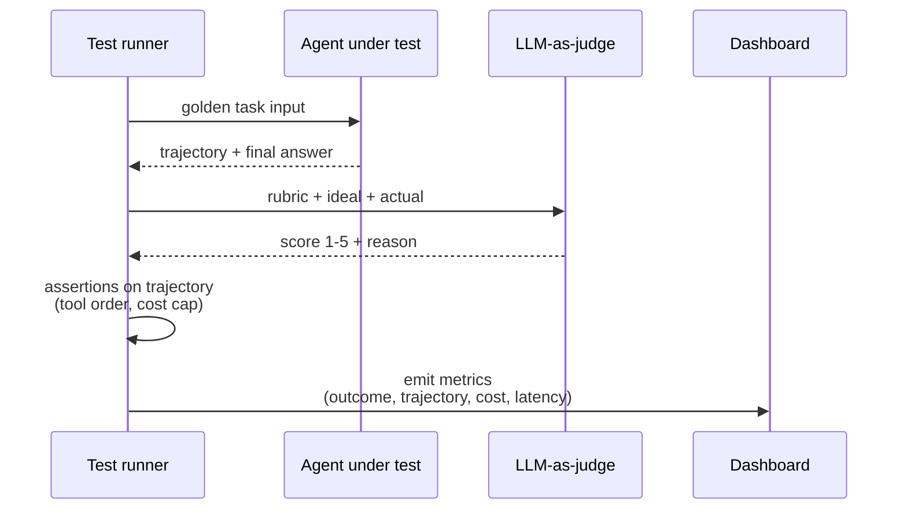

# Agents 3 — Agentic AI Evaluation

## Lectures covered
- Agentic AI Evaluation

---

## In one sentence
Agent evaluation is the discipline of grading not just the final answer but also the *path* the agent took to get there — tools, steps, cost, latency — so you can ship changes without breaking what worked.

## Real-world analogy
Grading an agent is like grading a chess player. "Did you win?" is one question; "Did you make the right moves to win?" is another. A player who blunders into a win and a player who plays a clean line are scored differently, because only one of them is reliable next game. Outcome eval is the win/loss column; trajectory eval is the move-by-move review.

## The intuition (plain English)
- A single number cannot capture agent quality. You need a small portfolio: outcome correctness, trajectory correctness, cost, latency, safety.
- Component evals catch boring bugs (retriever returns nothing, JSON malformed). Trajectory evals catch agentic bugs (right answer, wrong tool path). Outcome evals catch the obvious (was the user actually helped?).
- The cheapest scalable scorer is **LLM-as-judge**: a stronger Claude grades the production agent's outputs against a rubric. You still validate it agrees with humans before trusting it.
- Lock a small **golden set** (30–100 tasks) and run it on every prompt or model change. Vibe-checking is how regressions ship.
- For agents, always store the full **trajectory** (every tool call + observation). Without it, you cannot explain failures.

## Mini worked example — one ReAct loop graded three ways

Task: *"Find the next pending onboarding and create their accounts."*

```
turn 1  agent  : list_pending_onboardings()  → [{id:1, name:"Awais"}]
turn 2  agent  : create_email_account(name="Awais") → {email, pw}
turn 3  agent  : send_welcome_email(to=email)        → ok
turn 4  agent  : "Awais has been onboarded."         (end_turn)
```

Three lenses on the same trace:

| Eval lens | Question | Score |
|---|---|---|
| Component  | Did each tool return a valid shape?               | 3/3 |
| Trajectory | Did it call `list` before `create`, and skip non-required tools? | pass |
| Outcome    | LLM-judge vs ideal: "Awais has been onboarded."   | 5/5 |

Add cost + latency from the trace, and you have a five-number scorecard for one task. Run on 10 tasks → averages are your dashboard.

## At-a-glance



## Why this matters
- Agents touch real systems. A regression is not "lower BLEU" — it is "double-charged a customer."
- Every prompt tweak, model upgrade, and tool change risks silent breakage. Evals are how teams move fast without lighting the production agent on fire.
- Trajectory evals are the agent-specific bit you cannot copy from classic ML. Get them right and you debug 10× faster.
- Eval discipline is what separates a portfolio demo from a deployable product, and recruiters know the difference.

---

## 1. Why agent eval is hard

Classical ML eval is easy: you have labels, you compute accuracy. Agent eval is harder because:
- Outputs are open-ended (no single "right" answer)
- Multi-step decisions matter (good final answer with terrible reasoning is fragile)
- Tools have side effects (can't replay deterministically)
- Different runs can give different results
- Cost / latency / safety are first-class concerns

You need a **portfolio of evaluation methods**, not a single number.

---

## 2. Three evaluation layers

### Layer 1 — Component evals
Test individual building blocks:
- Does retrieval find the right docs?
- Does the tool wrapper return correct shapes?
- Does the prompt produce structured JSON?

### Layer 2 — Trajectory evals
For each task, inspect the **path** the agent took:
- Did it call the right tools in the right order?
- Did it avoid forbidden actions?
- Did it loop unnecessarily?

### Layer 3 — Outcome evals
The final answer / state:
- Did the user's request get fulfilled?
- Was the answer factually correct?
- Was the format right?

A good test suite covers all three.

---

## 3. Trajectory evals — the agent-specific bit

For each task, capture a trace:
```json
{
  "task": "Find the next pending onboarding and create their accounts",
  "steps": [
    {"tool": "list_pending_onboardings", "args": {}, "result": [{"id":1, "name":"Awais"}]},
    {"tool": "create_email_account", "args": {"name":"Awais"}, "result": "ok"},
    {"tool": "send_welcome_email", "args": {"to":"awais@..."}, "result": "ok"}
  ],
  "final_answer": "Awais has been onboarded."
}
```

### Assertions you can run on traces
- Tool X must be called before tool Y
- Tool Z must NOT be called
- Total tool calls ≤ N
- No tool is called > 3 times in a row
- Cost ≤ $X per task

### Tools
- **LangSmith** — captures traces, has eval primitives
- **Langfuse** — open-source equivalent
- Custom — log to DB, query for assertions

---

## 4. Outcome evals — LLM-as-judge

For open-ended outputs, use a strong LLM to score:
```python
def grade(question, answer, expected):
    prompt = f"""
    Question: {question}
    Expected answer: {expected}
    Actual answer: {answer}

    Score 1-5: how well does the actual answer cover what's expected?
    Return JSON: {{"score": <1-5>, "reasoning": "<one sentence>"}}
    """
    return judge_llm.invoke(prompt)
```

### Best practices
- Use the strongest model available as judge (Claude Opus / GPT-4)
- Provide clear rubric (1=garbage, 3=acceptable, 5=excellent)
- Few-shot the judge with examples of each score
- Average over multiple judge runs (or seeds)

### Caveats
- Judge has its own biases
- Don't have the same model self-judge unless you've validated
- Cost: judge calls add up; cheaper to LLM-judge a sample

---

## 5. RAGAS for RAG-based agents

If your agent does RAG, use RAGAS metrics:
- **Faithfulness** — does the answer rely only on retrieved context?
- **Answer relevance** — does it address the question?
- **Context precision / recall** — was the right info retrieved?

```bash
pip install ragas
```
```python
from ragas import evaluate
from ragas.metrics import faithfulness, answer_relevancy, context_recall

dataset = ...   # questions, answers, retrieved_contexts, ground_truths
result = evaluate(dataset, metrics=[faithfulness, answer_relevancy, context_recall])
```

---

## 6. Public benchmarks for agentic AI

Worth knowing for context:

- **SWE-Bench** — agents solve real GitHub issues (popular for code agents)
- **WebArena** — agents complete tasks on websites
- **GAIA** — general assistant benchmark; multi-hop reasoning + tool use
- **MMLU** — multitask language understanding (knowledge eval)
- **AgentBench** — multi-domain agent eval
- **τ-Bench** (Tau-Bench) — customer-service agent eval
- **MMMU** — multimodal multitask

Track your own benchmark numbers vs SOTA. For a portfolio: cite "model X achieves 87% on SWE-Bench, my agent achieves 35% on a similar task."

---

## 7. Building a custom eval suite (the bootcamp project way)

For Codebasics' projects, build a small suite per project:

### For the real-estate RAG (project 1)
- 30 user queries (varied: budget, location, type, edge cases)
- Per query: expected matching listings (gold)
- Metrics: top-5 hit rate, faithfulness, answer relevance

### For the e-commerce chatbot (project 2)
- 20 conversation flows (FAQs, product search, refund, escalate)
- Per flow: expected outcome (correct product? correct route?)
- Metrics: outcome correctness, # of clarification turns

### For the agentic onboarding (project 3)
- 10 tasks (different employee profiles)
- Per task: expected tool sequence (gold trace)
- Metrics: trace match rate, completion rate, # of unused tools

### For the customer-care agent (project 4)
- 50 customer scenarios across topics
- Metrics: resolution rate, escalation rate, time-to-resolution, customer-satisfaction (LLM-judged)

A repo with `evals/` directory + `pytest` for assertions makes this real.

---

## 8. CI/CD for prompts and agents

Treat prompts like code:
```yaml
# .github/workflows/eval.yml
on: [push, pull_request]
jobs:
  eval:
    runs-on: ubuntu-latest
    steps:
      - uses: actions/checkout@v4
      - run: pip install -r requirements.txt
      - run: python evals/run.py        # runs the agent on golden tasks, scores
      - run: python evals/check_thresholds.py  # fails if quality regressed
```

This prevents prompt regressions from sneaking into prod.

---

## 9. Cost & latency evals

Track per task:
- Total tokens (input + output)
- Total $ cost
- Wall-clock latency
- Number of tool calls

Set thresholds; fail builds that exceed.

A regression in prompt size or tool design can 10× your bill. Eval catches it.

---

## 10. Safety / red-team evals

For agents touching sensitive data or making consequential decisions:

- **Prompt injection probes** — inputs designed to trick the agent
- **Jailbreak attempts** — encourage refusal of harmful requests
- **PII leakage** — does the agent leak data it shouldn't?
- **Authorization bypass** — does it do things outside the user's permissions?

Frameworks: **Garak**, **PyRIT**, **Llama Guard**, custom probe sets.

---

## 11. Common pitfalls

| Mistake | Effect | Fix |
|---|---|---|
| Manual eval only | doesn't scale; biased | invest in automated evals early |
| Single golden answer | misses valid alternatives | use rubric / LLM judge |
| Eval only at end | regressions sneak in | run on every PR |
| LLM judge same as production model | bias | use a different / stronger judge |
| No trajectory eval | wrong reasoning hidden by lucky outputs | always evaluate the path |
| Ignoring cost / latency | bill explosion | always include them |

## Self-check

- [ ] Three layers of agent eval?
- [ ] What's a trajectory eval and what do you assert on?
- [ ] Walk through LLM-as-judge with rubric.
- [ ] What does RAGAS measure?
- [ ] Three public agentic benchmarks?
- [ ] Build an eval suite for a chatbot.
- [ ] How do you CI-test a prompt change?
- [ ] Two safety evals to add for sensitive agents.

---

## Glossary

| Term | Plain meaning |
|------|---------------|
| Eval / evaluation | Automated grading of LLM or agent outputs against a fixed test set. |
| Golden set | A locked set of (input, ideal output) pairs used to score every change. |
| Component eval | Tests one building block in isolation (retriever, parser, prompt). |
| Trajectory eval | Inspects the full path an agent took (tools, order, args, observations). |
| Outcome eval | Scores the final answer or end state. |
| Trace | The stored record of one agent run — every step, tool call, and message. |
| Trajectory assertion | A rule the trace must satisfy ("call X before Y", "never call Z"). |
| LLM-as-judge | Using a stronger LLM to score another LLM's output. |
| Rubric | The 1–5 scale and criteria the judge applies. |
| Reference-based eval | Compares candidate output to a known ideal answer. |
| Reference-free eval | Scores outputs without a reference (faithfulness, helpfulness). |
| Faithfulness | Does the answer stick to the retrieved context? |
| Answer relevance | Does the response actually address the question? |
| Context precision / recall | RAG metrics for retrieval quality. |
| RAGAS | Library for RAG-specific metrics. |
| Cohen's kappa | Inter-rater agreement adjusted for chance; how to validate a judge. |
| LangSmith / Langfuse | Hosted (and open-source) tracing + eval platforms. |
| DeepEval / Promptfoo | Pytest-style and YAML-driven eval frameworks. |
| Online eval | Sampling live traffic and grading it in the background. |
| Drift | Quality changing over time (data, model, or prompt). |
| Adversarial probe | An input crafted to break, jailbreak, or trick the agent. |
| PII leakage | The agent revealing personal data it should not. |
| Cost / latency budget | Per-task ceilings on tokens and seconds; CI fails if exceeded. |
| SWE-Bench / WebArena / GAIA | Public benchmarks for code, web, and general agents. |

## Further reading
- Previous in folder: [02-multi-agent-systems.md](./02-multi-agent-systems.md)
- Folder root: [01-agent-fundamentals.md](./01-agent-fundamentals.md)
- Module overview: [../04-agents-tool-use.md](../04-agents-tool-use.md)
- Full eval module: [../07-evaluation-llm-apps.md](../07-evaluation-llm-apps.md)
- RAG you are evaluating: [../03-rag-vector-databases.md](../03-rag-vector-databases.md)
- Tracing in LangGraph: [../03-orchestration/02-langgraph.md](../03-orchestration/02-langgraph.md)
- Building with Claude SDK: [../06-langchain-claude-api.md](../06-langchain-claude-api.md)
- RAGAS — [Documentation](https://docs.ragas.io/)
- DeepEval — [GitHub](https://github.com/confident-ai/deepeval)
- LangSmith — [Docs](https://docs.smith.langchain.com/)
- Anthropic — [Evaluating prompts](https://docs.anthropic.com/en/docs/test-and-evaluate/develop-tests)
