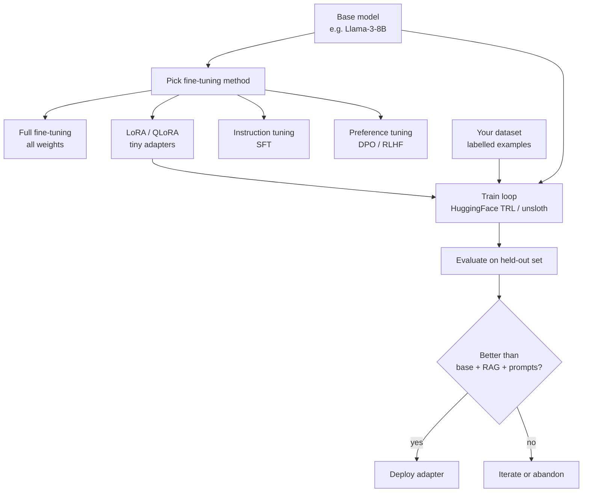
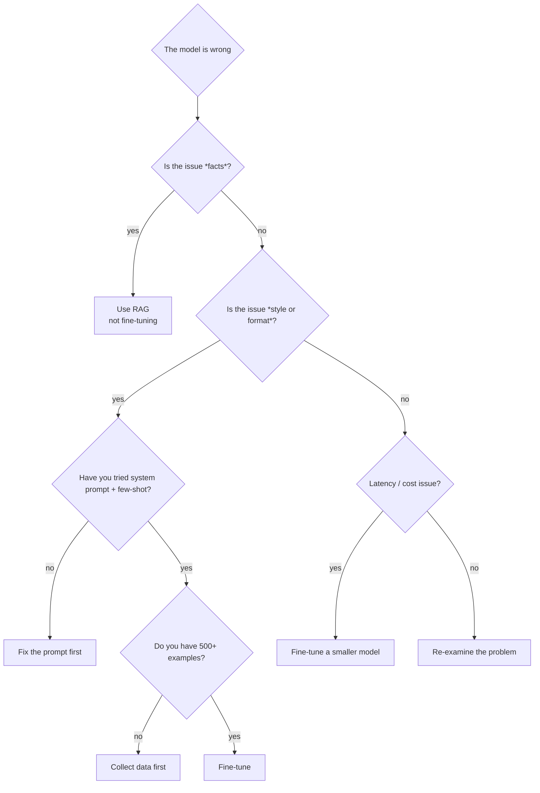

# 05 — Fine-Tuning LLMs

## Lectures covered
- Fine Tuning an LLM
- When to fine-tune vs prompt vs RAG
- LoRA / QLoRA basics
- Instruction tuning
- RLHF and preference tuning

---

## In one sentence
**Fine-tuning** is taking a pre-trained LLM and continuing to train it on your own labelled examples so it learns a behaviour, format, or domain you couldn't get with prompting alone.

## Real-world analogy
A medical resident graduates from med school knowing general medicine — that's pre-training. Specialising in cardiology by spending two more years in a cardiology ward — that's fine-tuning. They don't relearn anatomy; they layer new patterns on top of solid foundations.

## The intuition (plain English)
- Pre-training is brutally expensive (millions of dollars, months of GPU time). You will not do it.
- Fine-tuning starts from a pre-trained model and **nudges its weights** with your data — far cheaper.
- Most modern fine-tuning uses **LoRA** (Low-Rank Adaptation): instead of updating all 70B weights, you train tiny adapter matrices (~0.1% of the weights) that "patch" the model. Same quality, 100× cheaper.
- The right question is rarely "should I fine-tune?" — it's "have I exhausted prompting + RAG first?". Fine-tune for **behaviour and style**, RAG for **facts and freshness**.

## Mini worked example — when fine-tuning beats prompting

Task: classify customer support tickets into 12 internal product codes (`BILL-DUNNING`, `AUTH-2FA-RESET`, etc.) — codes nobody outside the company has ever seen.

| Approach | Accuracy | Per-call cost | Latency |
|---|---|---|---|
| Zero-shot Claude | 71% | normal | 1× |
| Few-shot (12 examples in prompt) | 86% | +30% (longer prompt) | 1× |
| Fine-tuned 7B Llama on 5,000 labelled tickets | 94% | ~10% of Claude | 0.3× |

After ~$50 of GPU rental for fine-tuning, the small specialist beats the giant generalist on accuracy, cost, and latency for **this one task**. That's the fine-tuning sweet spot.

## At-a-glance



## Why this matters
- A 7B fine-tuned model often beats a 70B prompt-engineered one on **narrow** tasks — at a fraction of the inference cost.
- Style transfer (matching your brand voice, output schemas, code conventions) is much cleaner from fine-tuning than from a 2,000-token system prompt.
- Open-source models (Llama, Qwen, Mistral) make custom fine-tuning achievable on a single GPU.
- Knowing when **not** to fine-tune is half the skill — it's the most over-prescribed solution in Gen AI.

---

## Deep dive

### 1. The decision tree — should you fine-tune?



| Symptom | Real fix |
|---|---|
| Wrong facts about my company | RAG |
| Out-of-date info | RAG |
| Wrong tone / format | Few-shot, then fine-tune |
| Refuses or rambles | Better system prompt |
| Too slow / expensive at scale | Fine-tune smaller open model |
| Needs to learn a new task with no examples in prompt-budget | Fine-tune |

### 2. The three flavours of fine-tuning

| Stage | Goal | Data shape | Sometimes called |
|---|---|---|---|
| **SFT** (Supervised Fine-Tuning) | Mimic ideal outputs | `(prompt, response)` pairs | Instruction tuning |
| **RM training** (Reward Modeling) | Learn what humans prefer | `(prompt, chosen, rejected)` | — |
| **RLHF / DPO** | Align with human preferences | uses RM or directly the preference pairs | Preference tuning |

The ChatGPT / Claude pipeline is roughly: **pre-train → SFT → RLHF**. As an applied practitioner, you'll mostly do SFT — and increasingly **DPO** (Direct Preference Optimisation), which is RLHF without the RL.

### 3. LoRA in two paragraphs

A neural net layer computes `y = x · W` where `W` is a huge matrix. Full fine-tuning updates every entry of `W`. LoRA freezes `W` and adds a tiny extra term:

```
y = x · W + x · (A · B)

  W  (d, k)        — frozen pre-trained weights
  A  (d, r)        — trainable, small matrix
  B  (r, k)        — trainable, small matrix
  r  ~= 8 to 64    — rank, the "bottleneck"
```

You're learning a low-rank approximation of the *change* the task needs. With `r=16` and a 7B model, LoRA trains ~10M parameters instead of 7B — 700× less.

**QLoRA** is the same idea but the frozen `W` is stored in 4-bit precision, so a 70B model fits on a single 48GB GPU. This is what made fine-tuning genuinely accessible.

### 4. Hands-on with HuggingFace TRL

```python
# Install: pip install trl peft transformers datasets bitsandbytes
from datasets import Dataset
from transformers import AutoModelForCausalLM, AutoTokenizer, BitsAndBytesConfig
from peft import LoraConfig
from trl import SFTConfig, SFTTrainer

model_id = "meta-llama/Llama-3.1-8B-Instruct"

# 4-bit quantised base model (QLoRA)
bnb = BitsAndBytesConfig(load_in_4bit=True, bnb_4bit_compute_dtype="bfloat16")
tokenizer = AutoTokenizer.from_pretrained(model_id)
model = AutoModelForCausalLM.from_pretrained(model_id, quantization_config=bnb)

# Your data: list of {"prompt": ..., "completion": ...}
data = Dataset.from_list([
    {"prompt": "Classify ticket: 'cant log in 2fa code wrong'",
     "completion": "AUTH-2FA-RESET"},
    # ... 4,999 more
])

# Tiny adapters
lora = LoraConfig(r=16, lora_alpha=32, target_modules=["q_proj", "v_proj"], lora_dropout=0.05)

trainer = SFTTrainer(
    model=model,
    tokenizer=tokenizer,
    train_dataset=data,
    args=SFTConfig(
        output_dir="./out",
        num_train_epochs=3,
        per_device_train_batch_size=4,
        learning_rate=2e-4,
    ),
    peft_config=lora,
)
trainer.train()
trainer.save_model("./ticket-classifier-lora")
```

The output is a **~50MB adapter file**, not a new 16GB model. You load the base + adapter at inference.

### 5. Direct Preference Optimisation (DPO)

DPO trains on `(prompt, chosen, rejected)` triples directly — no separate reward model.

```
Loss roughly says: "make the chosen response more likely than the rejected one,
relative to the base model, by margin β."
```

Useful when you have human ratings or A/B preferences (e.g. real users picking better answers).

### 6. Fine-tuning closed models

Some closed models offer fine-tuning APIs:

- **OpenAI** — `client.fine_tuning.jobs.create(...)` for GPT-4o-mini and similar.
- **Google Gemini** — supervised tuning via Vertex AI.
- **Anthropic Claude** — fine-tuning is available for select customers via Bedrock / Vertex; check the latest docs.

Workflow is similar: upload `(prompt, completion)` JSONL, kick off a job, get a fine-tuned model ID back.

```python
# Sketch — OpenAI
with open("train.jsonl", "rb") as f:
    file = client.files.create(file=f, purpose="fine-tune")
job = client.fine_tuning.jobs.create(training_file=file.id, model="gpt-4o-mini")
```

### 7. Data > everything

The biggest lever in fine-tuning is **data quality**, not hyperparameters. Heuristics:
- 500-5,000 high-quality examples often beat 100,000 noisy ones.
- Hold out 10-20% as a test set — never train on it.
- Diversify edge cases. Models overfit obvious patterns and miss the rare ones.
- Use a stronger model (Claude / GPT-4) to **bootstrap labels**, then have a human spot-check 10%.
- Match the production prompt format exactly. Train/serve skew is brutal.

### 8. Total cost of ownership

A fine-tuned model is an asset that needs:
- Storage (cheap for adapters, real for full models).
- Versioning and a rollback path.
- Re-training when the base model upgrades.
- Re-evaluation when the prompt template changes.
- A serving stack (vLLM, TGI, Bedrock) instead of just hitting an API.

For most teams, **prompt + RAG on Claude** has lower TCO than a self-hosted fine-tune. Fine-tune when you've measured a real, persistent gap that prompting can't close.

---

## Common pitfalls
- Fine-tuning to inject facts. Fine-tunes don't reliably memorise individual facts — use RAG.
- Tiny dataset (<200 examples). The model overfits and forgets general capability.
- Training data formatted differently from inference prompts. Always serialise the same way.
- Forgetting to evaluate. "It looks good on 5 examples" is not evaluation.
- No held-out set, so no real measure of generalisation.
- Catastrophic forgetting: aggressive fine-tuning can wreck unrelated capabilities. Lower learning rate + LoRA mitigates this.
- Skipping the **base model evaluation**. You need to know what the base scores before claiming the fine-tune helped.
- Choosing the biggest model out of habit. A fine-tuned 7B often beats a prompted 70B for narrow tasks.
- Ignoring licensing — Llama, Qwen, Mistral all have specific terms.

---

## Glossary

| Term | Plain meaning |
|---|---|
| Pre-training | Initial training on huge corpora to predict next token. Done once, by labs. |
| Fine-tuning | Continued training on smaller, task-specific data. |
| SFT | Supervised Fine-Tuning — learn from `(prompt, ideal response)` pairs. |
| Instruction tuning | SFT specifically on instruction-following data. |
| RLHF | Reinforcement Learning from Human Feedback — alignment via human ratings. |
| DPO | Direct Preference Optimisation — RLHF without the RL. |
| Reward model | A model that scores responses, used in RLHF. |
| LoRA | Low-Rank Adaptation — train tiny adapter matrices instead of full weights. |
| QLoRA | LoRA + 4-bit quantised base model — fits big models on small GPUs. |
| Adapter | The small trainable matrices added by LoRA. |
| Rank (r) | The bottleneck size of the LoRA matrices. Typical: 8-64. |
| PEFT | Parameter-Efficient Fine-Tuning — umbrella term for LoRA, prefix-tuning, etc. |
| Quantisation | Storing weights in lower precision (8-bit, 4-bit) to save memory. |
| Catastrophic forgetting | Losing earlier capabilities when fine-tuning. |
| Train/serve skew | Differences between training data format and production prompts. |
| Held-out set | Examples never seen during training, used to evaluate. |
| Base model | The pre-trained model before any fine-tuning. |
| Chat / instruct model | A base model already SFT'd to follow instructions. |
| Domain adaptation | Fine-tuning to make a model perform well in a specific domain (legal, medical). |
| Continued pre-training | Re-running pre-training on domain text — different from fine-tuning. |
| Token efficiency | How much useful behaviour you get per training token. |
| TRL | HuggingFace's Transformer Reinforcement Learning library. |
| PEFT library | HuggingFace library for LoRA-style methods. |
| vLLM / TGI | Open-source LLM serving engines. |
| Llama / Qwen / Mistral | Major open-source base model families. |

## Further reading
- Previous: [04-agents-tool-use.md](./04-agents-tool-use.md)
- Next: [06-langchain-claude-api.md](./06-langchain-claude-api.md)
- [BERT fine-tuning with HuggingFace](../08-nlp/07-bert-finetuning-huggingface.md) — encoder fine-tuning, the same mechanics on a smaller scale
- [Transformer architecture](../07-deep-learning/04-sequence/03-transformer-architecture.md)
- HuggingFace — [TRL docs](https://huggingface.co/docs/trl)
- HuggingFace — [PEFT docs](https://huggingface.co/docs/peft)
- Hu et al. — [LoRA paper](https://arxiv.org/abs/2106.09685)
- Dettmers et al. — [QLoRA paper](https://arxiv.org/abs/2305.14314)
- Rafailov et al. — [DPO paper](https://arxiv.org/abs/2305.18290)
