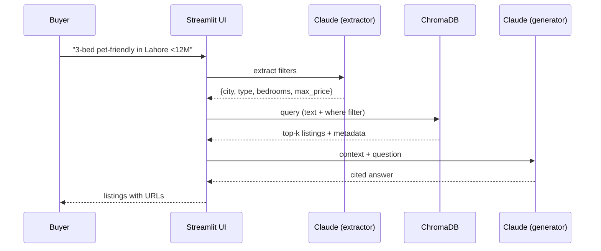

# Project 1 — Real Estate Assistant Using RAG

---

## In one sentence
Build a Claude-powered chat assistant that converts a buyer's natural-language wishlist ("3-bed pet-friendly under 8M PKR in Lahore") into a structured database query, retrieves the matching listings, and replies with cited recommendations.

## Real-world analogy
A real-estate agent who has memorised every listing, listens to your messy wishlist, narrows down the database to the dozen places that fit, and reads them back to you with the URL of each one — without ever inventing a property that doesn't exist.

## The intuition (plain English)
- A buyer's question is a mix of *hard filters* (city = Lahore, max price = 8M) and *soft preferences* (pet-friendly, near a park).
- Hard filters belong in a database `WHERE` clause; soft preferences belong in a vector search over the listing description.
- The Claude API does two jobs: first, it extracts the structured filters from the messy query; second, it composes the final answer over the retrieved listings.
- Always cite each listing with its URL — that grounds the answer and prevents the model from inventing properties.
- Add an evaluation set of 30 golden queries early; you cannot improve retrieval quality you are not measuring.

## Mini worked example — one query trace

User asks: *"Show me a 3-bedroom pet-friendly apartment in Lahore under 12M PKR."*

```
step 1  filter extraction (Claude)
        → {"city": "Lahore", "type": "apartment",
           "min_bedrooms": 3, "max_price": 12000000}

step 2  vector search ChromaDB
        text query   = "pet-friendly"
        where filter = (city=Lahore AND type=apartment
                        AND bedrooms>=3 AND price<=12_000_000)
        → top-3 listings with URLs and descriptions

step 3  answer composition (Claude)
        → "Here are 3 pet-friendly apartments under your budget in Lahore:
           1. DHA Phase 5 — 1200 sqft, 11.5M [https://.../l/421]
           2. Gulberg — 1100 sqft, 10.9M     [https://.../l/189]
           3. Bahria Town — 1300 sqft, 11.8M [https://.../l/733]"
```

Two Claude calls, one Chroma query, one cited answer. That's the whole product.

## At-a-glance



## Why this matters
- Real estate is a textbook RAG problem — high-stakes, structured + unstructured, citation-mandatory. A working build proves you can ship retrieval-augmented apps.
- Mixing metadata filters with vector search is the single most-used pattern in production RAG; this project drills it directly.
- Citations + an eval set turn a demo into something a hiring manager believes is real.
- The same pattern reskins for jobs boards, e-commerce search, medical records, legal discovery.

---

## Domain
A real-estate site has thousands of property listings. Users ask natural-language questions like:
- "3-bedroom apartment in Lahore under 8M PKR"
- "Pet-friendly studios near university"
- "Houses with garden and parking"

Build an **AI assistant** that retrieves relevant listings from the database and answers in natural language.

## Pattern
Classic **RAG** with structured filtering:
- Vector search over listing descriptions
- Metadata filtering on price / location / bedrooms
- LLM generates a clean, cited answer

---

## Architecture

```
user question
   │
   ▼
[Streamlit UI]
   │
   ▼
1. Extract structured filters from query (LLM call) ─► {city, max_price, bedrooms}
   │
   ▼
2. Vector search ChromaDB filtered by metadata
   │
   ▼
3. Top-k listings → context
   │
   ▼
4. LLM generates answer with cited listing IDs / URLs
   │
   ▼
display results + URLs in UI
```

---

## Step-by-step build

### 1. Data — listings dataset
Either:
- Codebasics-provided listings
- Public dataset (Kaggle: real-estate listings)
- Scrape (carefully) — practice for portfolio

Each listing should have:
```python
{
  "id": "...",
  "description": "...",      # full text — what we embed
  "city": "Lahore",
  "neighborhood": "DHA Phase 5",
  "type": "apartment",        # apartment / house / studio / villa
  "bedrooms": 3,
  "bathrooms": 2,
  "size_sqft": 1200,
  "price": 12_000_000,        # in PKR
  "url": "https://...",
}
```

### 2. Index in ChromaDB
```python
import chromadb
client = chromadb.PersistentClient(path="./re_db")
col = client.get_or_create_collection(name="listings")

col.add(
    documents=[l["description"] for l in listings],
    metadatas=[{k: l[k] for k in ["city","type","bedrooms","bathrooms","size_sqft","price","url"]}
               for l in listings],
    ids=[l["id"] for l in listings],
)
```

### 3. Filter extraction (the LLM converts NL → structured)

```python
from openai import OpenAI
import json

client = OpenAI()

def extract_filters(query: str) -> dict:
    resp = client.chat.completions.create(
        model="gpt-4o-mini", temperature=0,
        response_format={"type": "json_object"},
        messages=[
            {"role": "system", "content":
             "Extract structured search filters from the user query. "
             "Return JSON with optional keys: city, type, max_price, min_bedrooms. "
             "Omit unspecified keys."},
            {"role": "user", "content": query},
        ],
    )
    return json.loads(resp.choices[0].message.content)
```

### 4. Build the Chroma `where` from filters
```python
def build_where(filters):
    clauses = []
    if "city" in filters:
        clauses.append({"city": filters["city"]})
    if "type" in filters:
        clauses.append({"type": filters["type"]})
    if "max_price" in filters:
        clauses.append({"price": {"$lte": filters["max_price"]}})
    if "min_bedrooms" in filters:
        clauses.append({"bedrooms": {"$gte": filters["min_bedrooms"]}})

    if not clauses:    return {}
    if len(clauses) == 1: return clauses[0]
    return {"$and": clauses}
```

### 5. Search + generate

```python
def answer(query):
    filters = extract_filters(query)
    where   = build_where(filters)

    res = col.query(query_texts=[query], n_results=5, where=where)
    docs  = res["documents"][0]
    metas = res["metadatas"][0]

    if not docs:
        return "No matching listings found."

    context = "\n\n".join(
        f"[{m['url']}] {d}" for d, m in zip(docs, metas)
    )

    resp = client.chat.completions.create(
        model="gpt-4o-mini", temperature=0,
        messages=[
            {"role": "system", "content":
             "You are a real-estate assistant. Recommend listings from the context. "
             "Always cite each recommendation with its URL in [brackets]."},
            {"role": "user", "content":
             f"Context:\n{context}\n\nUser request: {query}"},
        ],
    )
    return resp.choices[0].message.content
```

### 6. Streamlit UI

```python
import streamlit as st

st.title("🏡 Real Estate Assistant")
query = st.text_area("Describe what you're looking for:")

if st.button("Search") and query:
    with st.spinner("Finding properties..."):
        result = answer(query)
    st.markdown(result)
```

That's a complete RAG product in **~120 lines**.

---

## Stretch goals (great for portfolio depth)

### A. Reranking
Add a cross-encoder rerank between top-50 and top-5.

### B. Image-aware
Listings often have photos. Add CLIP embeddings → users can query "with a pool" and find matching images.

### C. Conversational memory
Multi-turn: "show me 3-bedroom" → "make it cheaper" — uses session memory.

### D. Maps view
Geo coordinates in metadata; overlay top-5 results on a map.

### E. Lead generation
"I'm interested" button → captures contact and notifies an agent.

### F. Eval suite
30 golden queries with expected listings; track top-5 hit rate over time.

---

## Repo deliverables

```
real-estate-rag/
├── data/
│   └── listings.csv
├── notebooks/
│   ├── 01-data-prep.ipynb
│   ├── 02-index-build.ipynb
│   └── 03-eval.ipynb
├── src/
│   ├── retrieval.py
│   ├── filter_extractor.py
│   ├── answer.py
│   └── app.py            # Streamlit
├── evals/
│   ├── golden.json
│   └── run.py
├── re_db/                # chroma persistence (gitignored)
├── requirements.txt
└── README.md             # demo screenshots, eval numbers
```

---

## Self-check

- [ ] Did I extract structured filters before vector search?
- [ ] Are all answers grounded in retrieved listings (no hallucinated URLs)?
- [ ] Eval on 30 golden queries documented in README?
- [ ] Streamlit demo deployed publicly?
- [ ] Build-in-public LinkedIn post with demo link?
- [ ] Top-5 hit rate measured?
- [ ] Repo includes a clean README + run instructions?

---

## Glossary

| Term | Plain meaning |
|------|---------------|
| RAG | Retrieval-Augmented Generation — fetch relevant docs, then let the LLM answer with them as context. |
| Listing | A single property record in the database (description + price + city + URL). |
| Embedding | A vector representation of text used for similarity search. |
| Vector store | A database optimised for nearest-neighbour search on embeddings (here: ChromaDB). |
| ChromaDB | An open-source local vector store; persists to disk. |
| Metadata filter | A `WHERE`-style condition applied alongside the vector search. |
| `where` clause | ChromaDB's metadata-filter syntax (supports `$and`, `$lte`, `$gte`). |
| Filter extraction | Asking the LLM to convert a natural-language query into a JSON of structured filters. |
| Structured output | An LLM response forced into a known schema (JSON). |
| Top-k | The number of nearest matches the vector store returns. |
| Hard filter | A non-negotiable constraint (max price, city). |
| Soft preference | A nuanced wish that vector similarity handles ("near a park"). |
| Citation | The listing URL or ID attached to each recommendation in the answer. |
| Hallucination | The model inventing a listing or URL not present in retrieved context. |
| Reranker | A second-pass model that reorders top-50 hits into top-5 by relevance. |
| Cross-encoder | A scoring model that reads query + doc together for better relevance than embeddings. |
| Streamlit | A Python library for quick data app UIs. |
| Golden query | A hand-curated test query with known-good listings. |
| Top-5 hit rate | Fraction of golden queries where the right listing appears in the top 5. |
| Eval suite | A reproducible set of tests you run on every change. |
| Conversational memory | Multi-turn state across a user session (refine previous query). |
| CLIP embedding | An image-text joint embedding for searching photos by text. |

## Further reading
- Module overview: [../README.md](../README.md)
- Project 2 — chatbot with routing and SQL: [02-ecommerce-chatbot.md](./02-ecommerce-chatbot.md)
- Project 3 — agentic onboarding with MCP: [03-agentic-onboarding-mcp.md](./03-agentic-onboarding-mcp.md)
- Project 4 — production agent on AgentCore: [04-customer-care-agentcore.md](./04-customer-care-agentcore.md)
- RAG concepts: [../03-rag-vector-databases.md](../03-rag-vector-databases.md)
- Tools an agent could call instead: [../04-agents-tool-use.md](../04-agents-tool-use.md)
- Building with Claude SDK: [../06-langchain-claude-api.md](../06-langchain-claude-api.md)
- Evaluating retrieval + answers: [../07-evaluation-llm-apps.md](../07-evaluation-llm-apps.md)
- LangChain primer for chains: [../03-orchestration/01-langchain.md](../03-orchestration/01-langchain.md)
- ChromaDB — [Documentation](https://docs.trychroma.com/)
- Anthropic — [Tool use with Claude](https://docs.anthropic.com/en/docs/build-with-claude/tool-use)
