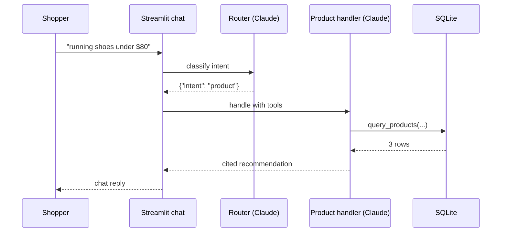

# Project 2 — E-Commerce Chatbot (Semantic Routing + DB)

---

## In one sentence
Build a Claude-powered shop assistant that classifies each incoming message into one of four intents (FAQ, product lookup, recommendation, escalate) and routes it to the right handler — combining vector search for policies with a SQLite tool call for live product data.

## Real-world analogy
Think of a junior support agent who never sleeps: they read every incoming message, decide whether it's a return question, a "do you have this in red?" question, or an angry "let me talk to a human" — then either answer from the policy binder, look up the catalogue, or hand off to a senior. The chatbot is the same triage on autopilot.

## The intuition (plain English)
- One giant prompt with all knowledge stuffed in does not scale. Routing first lets each handler specialise.
- The router is just a small Claude call that returns a JSON `{"intent": "faq" | "product" | "recommend" | "escalate"}`.
- FAQ-style questions go to RAG over policy docs; product questions become a SQL tool call; ambiguous or angry messages escalate to a human queue.
- For product lookup, give the model a `query_products` tool with typed parameters — it picks the filters from the user's words and your code runs the SQL.
- Always have an "escalate" fallback. A bot that gracefully hands off is more trusted than one that fakes confidence.

## Mini worked example — one ReAct loop trace

User asks: *"Find me running shoes under $80."*

```
step 1  router (Claude)
        → {"intent": "product"}

step 2  product handler dispatches Claude with tools
        Claude  : (tool_use) query_products(category="shoes",
                  name_like="running", max_price=80, in_stock=true)
        runtime : SQLite query → 3 rows
        Claude  : "Here are 3 in-stock running shoes under $80:
                   - Asics Gel-Excite ($69, 4.6★)
                   - Nike Revolution ($75, 4.4★)
                   - Adidas Galaxy ($55, 4.5★)"
```

Two Claude calls (router + answerer), one SQL query, one cited answer.

## At-a-glance



## Why this matters
- E-commerce support is the #1 deployed Gen AI use case in industry; this pattern shows up in every retail vendor pitch.
- Semantic routing + tool use is the canonical "agent meets database" pattern — interview gold.
- Clean separation between router and handlers makes the chatbot debuggable and testable per intent (intent accuracy can be benchmarked separately).
- The escalation path is what makes the bot safe for production; many demos skip it and pay later.

---

## Domain
An e-commerce store wants to handle FAQs, product search, and customer help via a chatbot. The bot should:
- Answer FAQ-style questions about shipping, returns, payment
- Look up real-time product info (price, stock) from a database
- Help recommend products
- Route human-needed cases to staff

## Pattern
**Semantic routing** + **tool use** + **SQLite database integration**:
- Classify the intent of the message
- Route to: FAQ retriever, product search, recommendation, or escalation
- Tool calls into SQLite for product data
- LLM generates the final response

---

## Architecture

```
user message
    │
    ▼
[Streamlit chat UI]
    │
    ▼
1. Intent router (LLM call) → "faq" / "product" / "recommend" / "escalate"
    │
    ├──► FAQ → vector search policies → LLM compose
    │
    ├──► Product → SQLite tool → LLM compose
    │
    ├──► Recommend → LLM with product context
    │
    └──► Escalate → "transferring to human" + log to ticket system
```

---

## 1. Data setup

### Products SQLite
```sql
CREATE TABLE products (
    id INTEGER PRIMARY KEY,
    name TEXT,
    category TEXT,
    description TEXT,
    price DECIMAL,
    stock INTEGER,
    rating REAL
);
```

Seed with a small catalog (~50 products across a few categories).

### FAQs vector store
A markdown file or CSV of (question, answer) pairs about shipping, returns, payment. Index in ChromaDB.

---

## 2. The intent router

```python
import json
from openai import OpenAI

client = OpenAI()

INTENTS = ["faq", "product", "recommend", "escalate"]

def route(message: str) -> str:
    resp = client.chat.completions.create(
        model="gpt-4o-mini", temperature=0,
        response_format={"type": "json_object"},
        messages=[
            {"role": "system", "content":
             f"Classify the user message into one intent: {INTENTS}.\n"
             "Return JSON: {\"intent\": <one of these>}."},
            {"role": "user", "content": message},
        ],
    )
    return json.loads(resp.choices[0].message.content)["intent"]
```

Or use **embedding-based routing**: embed the message, find nearest of pre-embedded intent prototypes. Cheaper, faster, often equally accurate.

---

## 3. Sub-handlers

### FAQ handler — RAG over policy docs
```python
import chromadb
chroma = chromadb.PersistentClient(path="./db")
faq_col = chroma.get_or_create_collection(name="faq")

def handle_faq(message):
    res = faq_col.query(query_texts=[message], n_results=3)
    context = "\n\n".join(res["documents"][0])
    resp = client.chat.completions.create(
        model="gpt-4o-mini", temperature=0,
        messages=[
            {"role": "system", "content":
             "Answer based on the policies below. If unclear, say you'll connect to support."},
            {"role": "user", "content": f"Policies:\n{context}\n\nQuestion: {message}"},
        ],
    )
    return resp.choices[0].message.content
```

### Product lookup — tool use over SQLite
```python
import sqlite3

DB = sqlite3.connect("products.db", check_same_thread=False)

def query_products(name_like: str | None = None, max_price: float | None = None,
                    category: str | None = None, in_stock: bool = True):
    sql = "SELECT id, name, category, price, stock, rating FROM products WHERE 1=1"
    params = []
    if name_like:
        sql += " AND name LIKE ?"; params.append(f"%{name_like}%")
    if max_price:
        sql += " AND price <= ?"; params.append(max_price)
    if category:
        sql += " AND category = ?"; params.append(category)
    if in_stock:
        sql += " AND stock > 0"
    rows = DB.execute(sql + " ORDER BY rating DESC LIMIT 5", params).fetchall()
    return [dict(zip(["id","name","category","price","stock","rating"], r)) for r in rows]
```

Then expose this as a tool the LLM can call:
```python
tools = [{
    "type": "function",
    "function": {
        "name": "query_products",
        "description": "Search the product catalog. Filters: name_like, max_price, category, in_stock.",
        "parameters": {
            "type": "object",
            "properties": {
                "name_like": {"type": "string"},
                "max_price": {"type": "number"},
                "category":  {"type": "string"},
                "in_stock":  {"type": "boolean"},
            },
        },
    },
}]
```

The LLM emits a `query_products` call with extracted args; you execute; feed back results.

### Recommend handler
Combine product retrieval with conversation history for personalized suggestions.

### Escalate handler
```python
def handle_escalate(message, user_id):
    log_to_support_queue(user_id, message)
    return "I'll connect you with our support team. They'll reach out shortly."
```

---

## 4. Putting it together

```python
def chat_response(message, user_id):
    intent = route(message)
    if   intent == "faq":      return handle_faq(message)
    elif intent == "product":  return handle_product_with_tools(message)
    elif intent == "recommend": return handle_recommend(message, user_id)
    elif intent == "escalate": return handle_escalate(message, user_id)
    else:                       return handle_faq(message)        # fallback
```

---

## 5. Streamlit chat UI

```python
import streamlit as st

st.title("🛒 ShopBot")

if "messages" not in st.session_state:
    st.session_state.messages = []

for m in st.session_state.messages:
    with st.chat_message(m["role"]):
        st.write(m["content"])

if user_input := st.chat_input("How can I help?"):
    st.session_state.messages.append({"role": "user", "content": user_input})
    with st.chat_message("user"): st.write(user_input)

    response = chat_response(user_input, user_id="anon")
    st.session_state.messages.append({"role": "assistant", "content": response})
    with st.chat_message("assistant"): st.write(response)
```

That's a working e-commerce chatbot.

---

## 6. Production-grade improvements (stretch)

### A. Order lookup tool
`get_order_status(order_id)` — needs auth.

### B. Refund tool with confirmation
Tool calls require user confirmation before executing.

### C. Conversation memory per user
Persist chat history; load on next visit.

### D. Multi-turn context
LangGraph for state-managed conversation.

### E. A/B test responses
Two prompts in parallel; track conversion / satisfaction.

### F. Analytics dashboard
Most-asked questions, escalation rates, top categories.

---

## 7. Eval suite

```python
golden = [
    {"input": "What's your return policy?", "intent": "faq"},
    {"input": "Find me running shoes under $80", "intent": "product"},
    {"input": "I want to talk to a human", "intent": "escalate"},
    # ... 30+ scenarios
]

correct = 0
for g in golden:
    pred_intent = route(g["input"])
    if pred_intent == g["intent"]:
        correct += 1
print(f"intent accuracy: {correct/len(golden):.2%}")
```

Plus: end-to-end "did it answer correctly" eval with LLM judge.

---

## 8. Repo deliverables

```
ecommerce-chatbot/
├── data/
│   ├── products.csv
│   └── faqs.md
├── src/
│   ├── router.py
│   ├── faq_handler.py
│   ├── product_handler.py
│   ├── tools.py             # SQL tool
│   └── app.py               # Streamlit chat
├── evals/
├── products.db
├── requirements.txt
└── README.md
```

---

## Self-check

- [ ] Does my router correctly classify ≥85% of intents?
- [ ] Do product queries return real DB rows?
- [ ] Are FAQ answers cited / grounded?
- [ ] Does the chat feel multi-turn (state across messages)?
- [ ] Does the eval suite include intent + outcome accuracy?
- [ ] Streamlit demo deployed?
- [ ] LinkedIn post with demo + lessons learned?

---

## Glossary

| Term | Plain meaning |
|------|---------------|
| Intent | The category of what the user wants (FAQ, product, recommend, escalate). |
| Semantic router | A classifier that maps a message to one intent using embeddings or an LLM. |
| Embedding-based routing | Pre-embed example phrases per intent; route by nearest neighbour. |
| LLM-based routing | Ask a small Claude call to return a JSON intent label. |
| Handler | The function dedicated to one intent. |
| FAQ retrieval | RAG over a small set of policy documents. |
| Tool use | The LLM emitting a function-call request your runtime executes. |
| `query_products` | The SQL-backed tool the LLM can call to look up the catalogue. |
| Tool schema | JSON Schema describing the tool's parameters and types. |
| SQLite | A file-backed SQL database; perfect for bootcamp projects. |
| ChromaDB | The vector store used for FAQ retrieval. |
| Escalation | Handing the conversation to a human queue. |
| Fallback | The safe default when the router is unsure. |
| Intent accuracy | Fraction of test messages classified into the right intent. |
| Outcome accuracy | Fraction of conversations that ended with the right result. |
| Multi-turn memory | Storing the chat history so follow-ups make sense. |
| `chat_input` / `chat_message` | Streamlit primitives for chat UIs. |
| Refund tool | A side-effect tool that should require user confirmation before firing. |
| Idempotency token | Identifier that prevents the same action from running twice. |
| LLM-as-judge | A stronger LLM scoring chat outcomes against a rubric. |
| A/B test | Run two prompts in parallel and measure which converts better. |
| PII | Personally identifiable information — redact in logs. |

## Further reading
- Module overview: [../README.md](../README.md)
- Project 1 — RAG over listings: [01-real-estate-rag.md](./01-real-estate-rag.md)
- Project 3 — agentic onboarding with MCP: [03-agentic-onboarding-mcp.md](./03-agentic-onboarding-mcp.md)
- Project 4 — production agent on AgentCore: [04-customer-care-agentcore.md](./04-customer-care-agentcore.md)
- Tool use with Claude: [../04-agents-tool-use.md](../04-agents-tool-use.md)
- RAG concepts: [../03-rag-vector-databases.md](../03-rag-vector-databases.md)
- Building with Claude SDK: [../06-langchain-claude-api.md](../06-langchain-claude-api.md)
- Evaluating chatbots: [../07-evaluation-llm-apps.md](../07-evaluation-llm-apps.md)
- LangGraph for stateful chats: [../03-orchestration/02-langgraph.md](../03-orchestration/02-langgraph.md)
- LangChain primer: [../03-orchestration/01-langchain.md](../03-orchestration/01-langchain.md)
- Anthropic — [Tool use with Claude](https://docs.anthropic.com/en/docs/build-with-claude/tool-use)
