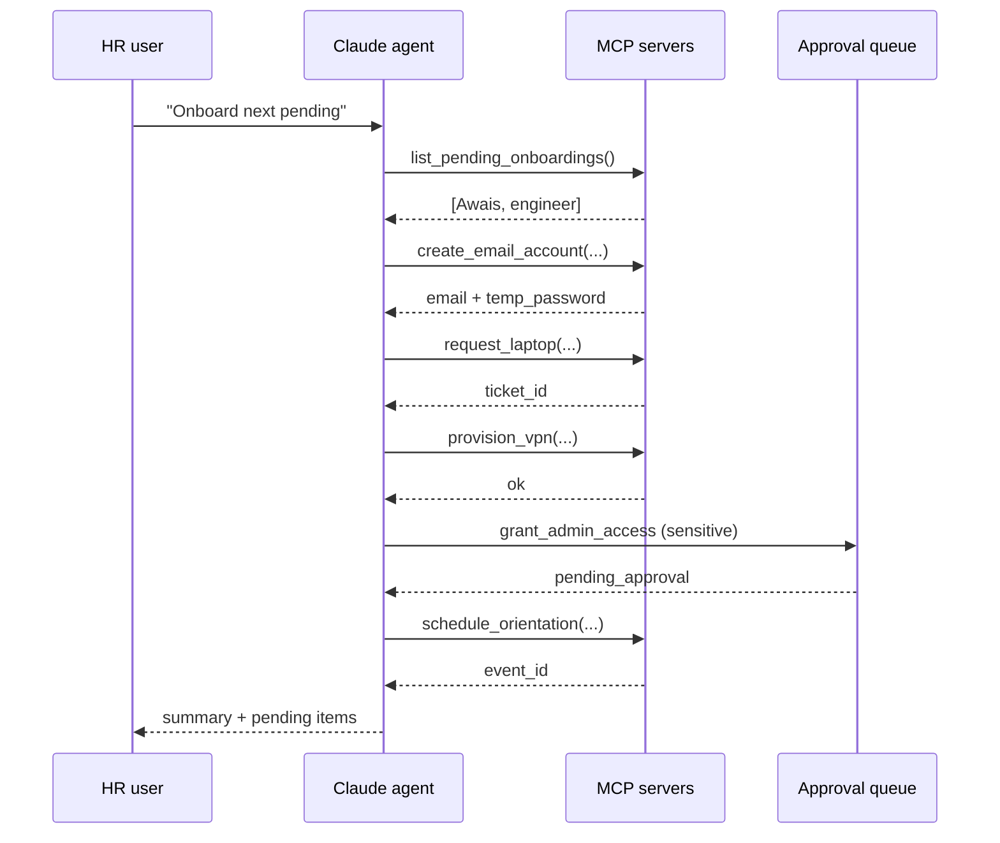

# Project 3 — Agentic AI HR Onboarding (MCP)

---

## In one sentence
Build a Claude agent that orchestrates a new-hire's full onboarding — email account, laptop, VPN, payroll, calendar, Slack — by calling tools exposed via the **Model Context Protocol (MCP)**, with human-in-the-loop checkpoints for sensitive actions.

## Real-world analogy
Think of a brand-new HR coordinator who has been handed a checklist, the master keychain to every internal system, and the rule "ask before you touch anything that costs money or grants admin access." They walk through the list, call each system in the right order, and report back when the new employee is fully set up. The agent is that coordinator; MCP is the master keychain.

## The intuition (plain English)
- Onboarding is 10+ steps across 6+ systems. Hard-coding the workflow is brittle; the wrong order breaks payroll.
- An agent is better here because each new hire has slightly different needs (engineer vs exec vs intern) and the model can reason about which steps apply.
- **MCP** is the open standard that lets you wrap each existing internal API — email, HR, equipment, calendar — as a uniform tool source. Same tool works across Claude, Claude Code, and any MCP-aware agent.
- Sensitive actions (granting admin, sending offers) gate behind human approval; the agent calls the tool, the tool returns `pending_approval`, the agent moves on.
- Always run in **dry-run mode** first: tools log what they *would* do without touching production. Flip the switch only after the eval suite passes.

## Mini worked example — one ReAct loop trace

User asks: *"Onboard the next pending engineer."*

```
turn 1  agent  : list_pending_onboardings()
                → [{id: 42, name: "Awais", role: "engineer", start: "2026-05-13"}]

turn 2  agent  : create_email_account(name="Awais", role="engineer")
                → {email: "awais@co.com", temp_password: "..."}

turn 3  agent  : request_laptop(employee_id=42, model="MacBook Pro")
                → {ticket_id: "IT-9981"}

turn 4  agent  : provision_vpn(employee_id=42)
                → {status: "ok"}

turn 5  agent  : invite_to_slack(email="awais@co.com",
                                 channels=["#general", "#engineering"])
                → {status: "ok"}

turn 6  agent  : schedule_orientation(employee_id=42, start_date="2026-05-13")
                → {calendar_event: "evt_551"}

turn 7  agent  : "Awais (engineer) has been onboarded:
                   email created, laptop ticket IT-9981 filed,
                   VPN active, Slack invited, orientation booked
                   for 2026-05-13. Manager approval still pending
                   for admin access."   (end_turn)
```

Six tool calls (each one an MCP server response), one finished employee.

## At-a-glance



## Why this matters
- MCP is the most relevant 2025–2026 standard for AI tool integration. A working build proves you've moved past the "agent demo on toy tools" stage.
- Wrapping real APIs as MCP servers is the exact skill enterprises pay for; every Fortune 500 has dozens of internal APIs that need this treatment.
- The human-in-the-loop pattern is what makes agentic automation safe for HR, finance, and ops — domains with real legal exposure.
- This is the project that signals to AI-engineering recruiters: "I can ship agents that do real work, not just summarise."

---

## Domain
Onboarding a new hire usually requires 10+ steps across systems:
- Create email account
- Provision laptop / VPN access
- Add to HR systems
- Send welcome packet
- Schedule orientation sessions
- Add to project management tool
- Set up payroll
- Create calendar invites

Each step → a different system, often a different team. **Agentic AI** automates this end-to-end, using **MCP** as the standard interface to all those systems.

## Pattern
- Wrap each existing HR API as an **MCP server**
- Build an LLM-driven **agent** (Claude via the SDK) that plans + orchestrates
- The agent calls multiple MCP tools to complete onboarding
- Human-in-the-loop for critical decisions (sensitive permissions)

---

## Architecture

```
[New hire profile] ──► [LLM Agent (Claude)]
                           │
                           ├──► MCP server: email_system   (create_email)
                           ├──► MCP server: hr_system      (add_employee, set_payroll)
                           ├──► MCP server: equipment      (request_laptop, provision_vpn)
                           ├──► MCP server: calendar       (schedule_orientation)
                           ├──► MCP server: docs           (send_welcome_packet)
                           └──► MCP server: project_tools  (add_to_jira, slack_invite)

                           Each MCP server wraps existing internal APIs.
```

---

## Why this pattern wins

Without MCP: every new internal system requires bespoke agent integration.
With MCP: wrap each system as one MCP server → every existing AI tool can use it.

For Codebasics' bootcamp project: this is the **most modern way** to expose your internal APIs to AI.

---

## Step-by-step

### 1. Identify the "tools" (functions the agent will call)

```
- list_pending_onboardings()
- create_email_account(name, role)
- send_welcome_email(to, template)
- request_laptop(employee_id, model="MacBook Pro")
- provision_vpn(employee_id)
- add_to_hr_system(employee_data)
- schedule_orientation(employee_id, start_date)
- add_to_jira(employee_id)
- invite_to_slack(email, channels)
- check_status(employee_id)
```

### 2. Build MCP servers (one per system, or one combined)

```python
# hr_mcp_server.py
from mcp.server.fastmcp import FastMCP
from typing import Literal

mcp = FastMCP("HR Onboarding System")

@mcp.tool()
def list_pending_onboardings() -> list[dict]:
    """List employees pending onboarding (status='pending')."""
    return query_hr_db("SELECT id, name, role, start_date FROM employees WHERE status = 'pending'")

@mcp.tool()
def create_email_account(name: str, role: str) -> dict:
    """Create a new corporate email account.
    USE WHEN: A new employee needs an email.
    Returns: {email, temp_password}.
    """
    # call your existing email-provisioning API
    email = generate_email(name)
    pw = create_in_email_system(email, role)
    return {"email": email, "temp_password": pw}

@mcp.tool()
def send_welcome_email(to: str, template: Literal["standard", "engineering", "exec"] = "standard") -> dict:
    """Send a welcome email to the new employee."""
    return send_via_email_api(to, template)

@mcp.tool()
def request_laptop(employee_id: str, model: str = "MacBook Pro") -> dict:
    """Request a laptop from IT."""
    return create_it_ticket(employee_id, kind="laptop", model=model)

# ... more tools

if __name__ == "__main__":
    mcp.run()
```

### 3. The agent — Claude with MCP

```python
import anthropic, asyncio
from mcp import ClientSession, StdioServerParameters
from mcp.client.stdio import stdio_client

claude = anthropic.Anthropic()

async def onboard_one():
    server = StdioServerParameters(command="python", args=["hr_mcp_server.py"])

    async with stdio_client(server) as (read, write):
        async with ClientSession(read, write) as session:
            await session.initialize()

            tools = (await session.list_tools()).tools
            anthropic_tools = [{
                "name": t.name,
                "description": t.description,
                "input_schema": t.inputSchema,
            } for t in tools]

            messages = [{"role": "user", "content":
                         "Onboard the next pending employee. Complete all required steps."}]

            while True:
                resp = claude.messages.create(
                    model="claude-sonnet-4-6",
                    max_tokens=2048,
                    tools=anthropic_tools,
                    messages=messages,
                )

                if resp.stop_reason == "end_turn":
                    print("Done.\n", resp.content[0].text if resp.content else "")
                    break

                # Process tool uses
                tool_results = []
                for block in resp.content:
                    if block.type == "tool_use":
                        result = await session.call_tool(block.name, block.input)
                        tool_results.append({
                            "type": "tool_result",
                            "tool_use_id": block.id,
                            "content": str(result.content),
                        })

                messages.append({"role": "assistant", "content": resp.content})
                messages.append({"role": "user", "content": tool_results})

asyncio.run(onboard_one())
```

The agent will:
1. Call `list_pending_onboardings()`
2. Pick the first employee
3. Call `create_email_account` → `request_laptop` → `provision_vpn` → ... in sequence
4. Reason about which steps are needed for that role
5. Output a final summary

---

## 4. Adding human-in-the-loop

For sensitive actions (provisioning admin access, sending welcome with sensitive info):

### Option A — Pause for approval
```python
@mcp.tool()
def grant_admin_access(employee_id: str, reason: str) -> dict:
    """Grant admin access. Requires manager approval (out-of-band)."""
    request_id = create_approval_request(employee_id, reason)
    return {"request_id": request_id, "status": "pending_approval"}
```

The agent calls; the tool returns `pending_approval`. Manager approves separately. The agent moves on or waits.

### Option B — LangGraph with `interrupt_before`
Insert a checkpoint before sensitive tools. Resume after human review.

---

## 5. Streamlit dashboard

A simple UI lets HR run / monitor / approve onboardings:
- "Onboard next" button
- Live tool-call log streaming
- Pending approval queue
- Per-employee status

```python
import streamlit as st

st.title("🤖 HR Onboarding Agent")

if st.button("Onboard next pending employee"):
    placeholder = st.empty()
    for log_entry in onboard_one_streaming():
        placeholder.text_area("Log", log_entry, height=400)
```

---

## 6. Eval & safety

For agents touching real systems:
- **Dry-run mode** for testing (tools log instead of executing)
- **Per-tool approval flags** in code
- **Audit log** of every tool call to a database
- **Rate limits** on tool calls per session
- **Hard cap** on total cost per onboarding

For production: route every action through your existing IT change-management workflow before it actually executes.

---

## 7. Why this is the most "real-world" portfolio project

- Demonstrates **MCP** — the most relevant 2024–2025 standard
- Demonstrates **agent orchestration** — concrete value, not just a chatbot
- Demonstrates **system integration** — wrapping real APIs
- Recruiters see: "Awais built an actual workflow agent, not a demo"

This is the project that gets you noticed by AI-engineering hiring managers.

---

## Repo deliverables

```
hr-onboarding-mcp/
├── mcp_servers/
│   ├── email_server.py
│   ├── hr_server.py
│   ├── equipment_server.py
│   └── calendar_server.py
├── agent/
│   └── onboard.py
├── ui/
│   └── app.py                # Streamlit dashboard
├── tests/
│   └── test_onboarding_flow.py
├── README.md                  # setup, MCP server config, demo
└── requirements.txt
```

---

## Self-check

- [ ] Do I have ≥3 MCP servers wrapping different systems?
- [ ] Does the agent successfully complete a full onboarding (with mocked APIs)?
- [ ] Did I implement human-in-the-loop for sensitive actions?
- [ ] Audit log of every tool call?
- [ ] Cost / rate limits in place?
- [ ] README explains: what MCP is, why this design, how to extend?
- [ ] Streamlit dashboard for observability?
- [ ] LinkedIn post explaining MCP + showing the agent in action?

---

## Glossary

| Term | Plain meaning |
|------|---------------|
| Agent | An LLM in a loop that calls tools and decides next steps. |
| MCP | Model Context Protocol — Anthropic's open standard for exposing tools and data to LLMs. |
| MCP server | A process that publishes tools, resources, and prompts via MCP. |
| MCP client | The LLM-facing side that connects to one or more MCP servers. |
| FastMCP | The convenience Python framework for writing MCP servers (`@mcp.tool()` decorator). |
| Tool | A function the agent can invoke (here: each onboarding action). |
| Tool description | The plain-English text the model reads to decide when to call a tool. |
| Tool result | The output of a tool, fed back to the model as a `tool_result` block. |
| Stdio transport | One way an MCP client talks to a server — over standard input/output. |
| `stdio_client` | The MCP client helper that spawns the server as a subprocess. |
| Human-in-the-loop | Pausing the agent for a human approval before a sensitive action runs. |
| Pending approval | A status returned by a tool meaning "I queued this; a human must sign off." |
| Dry-run mode | Tools log what they would do without actually executing. |
| Audit log | Persistent record of every tool call and result, for compliance. |
| Rate limit | Max tool calls per session or hour. |
| Cost cap | Hard ceiling on dollars spent per onboarding. |
| Idempotency | Calling a tool twice with the same input is safe (no double-onboarding). |
| LangGraph `interrupt_before` | A LangGraph primitive that pauses execution before a chosen node. |
| Streamlit dashboard | A simple UI for HR to launch, watch, and approve onboardings. |
| Trace | The full record of one agent run for debugging and compliance. |
| `stop_reason` | Claude API field signalling end-of-turn or tool-use. |
| Tool sequence eval | Asserting the agent called tools in a sensible order. |

## Further reading
- Module overview: [../README.md](../README.md)
- Project 1 — RAG over listings: [01-real-estate-rag.md](./01-real-estate-rag.md)
- Project 2 — chatbot with routing and SQL: [02-ecommerce-chatbot.md](./02-ecommerce-chatbot.md)
- Project 4 — production agent on AgentCore: [04-customer-care-agentcore.md](./04-customer-care-agentcore.md)
- MCP deep dive: [../03-orchestration/04-mcp.md](../03-orchestration/04-mcp.md)
- Tool use foundations: [../04-agents-tool-use.md](../04-agents-tool-use.md)
- LangGraph for agent flows: [../03-orchestration/02-langgraph.md](../03-orchestration/02-langgraph.md)
- Building with Claude SDK: [../06-langchain-claude-api.md](../06-langchain-claude-api.md)
- Trajectory and outcome eval: [../07-evaluation-llm-apps.md](../07-evaluation-llm-apps.md)
- Anthropic — [Model Context Protocol](https://modelcontextprotocol.io/)
- Anthropic — [Tool use with Claude](https://docs.anthropic.com/en/docs/build-with-claude/tool-use)
- Anthropic — [Building effective agents](https://www.anthropic.com/research/building-effective-agents)
