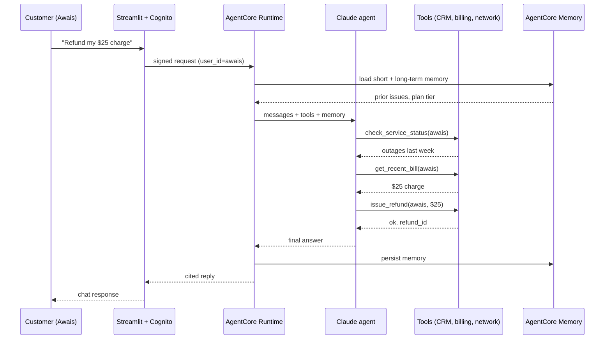

# Project 4 — Customer Care AI Agent on Bedrock AgentCore

---

## In one sentence
Build a Claude-powered customer-care agent that runs on **Amazon Bedrock AgentCore** — with per-user identity, persistent memory, sandboxed tools, refund caps, and a 50-scenario eval suite — so the agent autonomously resolves 80% of tickets and gracefully escalates the rest.

## Real-world analogy
Think of a senior support rep who has read every customer's full history, can pull up bills and outage maps in seconds, can issue small refunds on their own authority, but knows to flag a manager for anything over $50 — and who logs every action so compliance can replay the call later. The agent is that rep, scaled to thousands of conversations at once.

## The intuition (plain English)
- A telecom or SaaS support inbox is the perfect agent target: predictable tools, repetitive intents, big payoff per ticket deflected.
- The agent's job is to call the right tool (`get_recent_bill`, `check_service_status`, `issue_refund`, `escalate_to_human`) and explain the result; identity locks each tool to the authenticated customer's data.
- AgentCore wraps your Claude-via-LangGraph agent with the messy production bits: Cognito auth, per-user memory store, sandboxed code interpreter, audit logs, observability traces.
- Hard guardrails matter: refunds capped at $50, larger ones return `pending_approval`; jailbreak attempts are refused; PII is redacted in logs.
- Eval suite of 50 scenarios runs on every deploy; if tool-selection accuracy or escalation rate regresses, the build fails.

## Mini worked example — one ReAct loop trace

User Awais asks: *"Refund my last charge of $25, my internet has been terrible all week."*

```
turn 1  agent  : check_service_status(user_id="awais")
                → {outages_last_week: 4, last_outage: "2026-05-08"}

turn 2  agent  : get_recent_bill(user_id="awais")
                → {amount: 79.00, last_charge: 25.00, charge_date: "2026-05-07"}

turn 3  agent  : issue_refund(user_id="awais", amount=25.00,
                              reason="documented outages 2026-05-08")
                → {status: "ok", refund_id: "R-7741"}

turn 4  agent  : "I've confirmed 4 outages in your area last week and
                  refunded the $25 charge from May 7 (refund R-7741, 3-5
                  business days). Sorry for the disruption — anything else?"
                  (end_turn)
```

Three tools, one autonomous resolution, one logged audit trail. Memory stores "Awais had a refund issued for May outages" so the next conversation starts smarter.

## At-a-glance



## Why this matters
- This is the most enterprise-grade project in the bootcamp: AWS, identity, memory, observability, and safety all in one repo.
- Recruiters at AI-engineering teams skim resumes for exactly these capabilities. A working AgentCore demo is rare.
- The pattern (Claude + LangGraph + AgentCore + identity + tool gating) is the template for production agents in finance, telecom, healthcare, and SaaS.
- Refund caps + escalation flows are how agents survive contact with real customers — this project drills the full safety story.

---

## Domain
A telecom / SaaS company has thousands of daily customer-care queries:
- "What's my bill this month?"
- "Cancel my subscription."
- "Why is my service slow?"
- "Refund the last charge."

Build a **production-grade AI agent** running on **Amazon Bedrock AgentCore** that handles 80% of these autonomously and escalates the rest.

## Pattern
- Multi-tool agent with auth-scoped data access
- Persistent memory (per-customer history)
- AgentCore for runtime, identity, observability
- Streamlit UI calling the deployed AgentCore endpoint

This is the **most enterprise-grade** project in the bootcamp.

---

## Architecture

```
[Streamlit UI]
   │ HTTPS (Cognito auth)
   ▼
[AgentCore Runtime — your agent]
   │
   ├──► AgentCore Memory  (short-term + long-term)
   ├──► AgentCore Identity (per-user OAuth context)
   ├──► AgentCore Browser (sandboxed web actions)
   ├──► AgentCore Code Interpreter (sandboxed Python)
   │
   └──► Tools (your business APIs):
         - get_customer_profile(user_id)
         - get_recent_bill(user_id)
         - check_service_status(user_id)
         - issue_refund(user_id, amount, reason)
         - escalate_to_human(user_id, summary)
```

---

## Step-by-step build

### 1. Define the agent's tools

```python
from langchain_core.tools import tool

@tool
def get_customer_profile(user_id: str) -> dict:
    """Get the authenticated customer's profile.
    USE WHEN: you need plan, contact info, or account status."""
    return crm_api.get_profile(user_id)

@tool
def get_recent_bill(user_id: str) -> dict:
    """Get the most recent bill for the authenticated customer."""
    return billing_api.get_bill(user_id, latest=True)

@tool
def check_service_status(user_id: str) -> dict:
    """Check if the customer's service has any active outages."""
    return network_api.status_for(user_id)

@tool
def issue_refund(user_id: str, amount: float, reason: str) -> dict:
    """Issue a refund up to $50 for the authenticated customer.
    REQUIRES MANAGER APPROVAL for amounts > $50.
    """
    if amount > 50:
        return {"status": "needs_approval", "approval_id": create_approval(user_id, amount, reason)}
    return billing_api.refund(user_id, amount, reason)

@tool
def escalate_to_human(user_id: str, summary: str) -> dict:
    """Hand off to a human agent with a context summary.
    USE WHEN: customer requests human, you can't resolve, or sensitive issue."""
    return support_api.escalate(user_id, summary)
```

### 2. Build the agent (LangGraph)

```python
from langchain_aws import ChatBedrock
from langgraph.prebuilt import create_react_agent

llm = ChatBedrock(model_id="anthropic.claude-sonnet-4-v1")

agent = create_react_agent(
    llm,
    tools=[get_customer_profile, get_recent_bill, check_service_status,
            issue_refund, escalate_to_human],
)
```

### 3. Wrap with AgentCore SDK

```python
# This is conceptual; actual API names may differ.
from bedrock_agentcore import AgentCoreApp, MemoryStrategy, IdentityConfig

app = AgentCoreApp(
    name="customer-care-agent",
    handler=agent,
    memory=MemoryStrategy(
        short_term=True,                                # convo turns
        long_term=["customer_preferences", "past_issues"],
    ),
    identity=IdentityConfig(provider="cognito"),
    observability=True,
)

# Run locally
app.run()
```

### 4. Deploy

```bash
agentcore deploy
```

You get an HTTPS endpoint. Auth is Cognito-backed per-user.

### 5. Streamlit UI

```python
import streamlit as st
import requests

st.title("📞 Customer Care")

# user_id from your auth flow (Cognito-backed)
user_id = st.session_state.get("user_id")

if "messages" not in st.session_state:
    st.session_state.messages = []

for m in st.session_state.messages:
    with st.chat_message(m["role"]):
        st.write(m["content"])

if msg := st.chat_input("How can I help?"):
    st.session_state.messages.append({"role": "user", "content": msg})
    with st.chat_message("user"): st.write(msg)

    resp = requests.post(
        f"{AGENTCORE_ENDPOINT}/invoke",
        headers={"Authorization": f"Bearer {get_cognito_token(user_id)}"},
        json={"input": msg, "user_id": user_id},
    )
    answer = resp.json()["output"]
    st.session_state.messages.append({"role": "assistant", "content": answer})
    with st.chat_message("assistant"): st.write(answer)
```

### 6. Memory in action

After a few interactions, the agent's long-term memory holds:
- "Awais prefers email contact"
- "Awais has had 2 service complaints in the past month"
- "Awais's plan: Premium"

When Awais asks about service quality, the agent:
- Pulls relevant memory automatically
- Tailors response based on context

---

## 7. Observability

AgentCore's built-in tracing:
- Every customer interaction → full trace
- Tool calls + LLM messages + latency + cost per turn
- Audit log of every refund issued (for compliance)
- Alerts on error rate spikes

Visible in the AgentCore console + CloudWatch.

---

## 8. Eval suite (50 customer scenarios)

```python
scenarios = [
    {"query": "What's my bill?", "expected_tools": ["get_recent_bill"]},
    {"query": "Why is my internet slow?", "expected_tools": ["check_service_status"]},
    {"query": "Refund my last charge of $25", "expected_tools": ["issue_refund"]},
    {"query": "I need to talk to a human", "expected_tools": ["escalate_to_human"]},
    # ... 50+
]
```

For each: run the agent (in dry-run / mock mode), inspect the trace, score:
- Did it call the right tools?
- Was the response helpful?
- Did it escalate when it should have?
- Cost per query?

Track regressions across deploys.

---

## 9. Safety & guardrails

- **Refund cap**: $50 hard limit; bigger needs human approval
- **Authentication required**: tools see only the authed user's data
- **PII redaction** in logs
- **Rate limit** per customer per hour
- **Refusal of harmful instructions** (jailbreaks)
- **Escalation triggers**: legal threats, repeated frustration, irreversible actions

---

## 10. Why this project lands a job

It demonstrates:
- Production AI agent architecture
- AWS / cloud experience
- Identity + auth handling
- Memory design
- Observability + audit
- Safety / guardrails

These are *exactly* what AI-engineering job descriptions list. A working AgentCore demo on your portfolio is rare and impressive.

---

## Repo deliverables

```
customer-care-agentcore/
├── src/
│   ├── tools.py                    # tool definitions
│   ├── agent.py                    # LangGraph agent
│   ├── deploy.py                   # AgentCore wrapping + deploy
│   └── ui.py                       # Streamlit UI
├── evals/
│   ├── scenarios.json
│   ├── run.py
│   └── traces/                     # captured runs
├── infra/
│   ├── cognito-setup.md
│   └── iam-policies.md
├── docs/
│   ├── architecture.md
│   ├── safety-guardrails.md
│   └── memory-design.md
├── README.md                        # demo, screenshots, eval results
└── requirements.txt
```

---

## Self-check

- [ ] Agent reliably handles 80% of test scenarios?
- [ ] Refunds capped + manager approval flow working?
- [ ] Memory persists across customer interactions?
- [ ] Observability traces visible in AgentCore console?
- [ ] Identity ensures tools see only the authed user's data?
- [ ] Streamlit UI functional + auth-protected?
- [ ] 50-scenario eval suite + results in README?
- [ ] LinkedIn post: "Built a production AI agent on AWS AgentCore — end-to-end demo + lessons"?

---

## Glossary

| Term | Plain meaning |
|------|---------------|
| AgentCore | Amazon Bedrock's runtime for hosting production agents with identity, memory, and observability built in. |
| Bedrock | AWS's managed service for foundation models (Claude available here). |
| LangGraph | The state-machine framework used to wire the ReAct agent. |
| `create_react_agent` | LangGraph helper that builds a standard ReAct loop from an LLM + tools. |
| `ChatBedrock` | LangChain wrapper that calls Claude via Bedrock. |
| Cognito | AWS's user-auth service; provides per-user OAuth tokens. |
| Identity context | The authenticated user's ID, available to every tool call. |
| Auth-scoped tool | A tool that only returns data for the calling user. |
| Short-term memory | Conversation-turn buffer kept inside one session. |
| Long-term memory | Per-user facts and preferences persisted across sessions. |
| Memory strategy | The config that says what to remember and for how long. |
| Sandboxed Code Interpreter | A managed Python environment the agent can run code in safely. |
| Sandboxed Browser | A managed headless browser the agent can drive safely. |
| Observability | Built-in tracing of every tool call, message, latency, and cost. |
| Trace | The full record of one agent invocation. |
| Audit log | Persistent record of consequential actions (refunds, escalations). |
| Refund cap | Hard limit ($50) above which manager approval is required. |
| Manager approval flow | Pending-approval status returned by the tool until a human signs off. |
| Escalation | Handing the conversation to a human queue with a context summary. |
| PII redaction | Stripping personal data from logs before storage. |
| Rate limit | Max calls per customer per hour. |
| Jailbreak | An input designed to bypass safety constraints; should be refused. |
| Resolution rate | Fraction of tickets closed without human help. |
| Eval scenario | One labelled (input, expected_tools, expected_outcome) test case. |
| Tool-selection accuracy | Did the agent pick the right tools for this scenario? |

## Further reading
- Module overview: [../README.md](../README.md)
- Project 1 — RAG over listings: [01-real-estate-rag.md](./01-real-estate-rag.md)
- Project 2 — chatbot with routing and SQL: [02-ecommerce-chatbot.md](./02-ecommerce-chatbot.md)
- Project 3 — agentic onboarding with MCP: [03-agentic-onboarding-mcp.md](./03-agentic-onboarding-mcp.md)
- AgentCore deep dive: [../03-orchestration/05-amazon-bedrock-agentcore.md](../03-orchestration/05-amazon-bedrock-agentcore.md)
- Agent fundamentals: [../04-agents-tool-use.md](../04-agents-tool-use.md)
- LangGraph for stateful agents: [../03-orchestration/02-langgraph.md](../03-orchestration/02-langgraph.md)
- LangChain primer: [../03-orchestration/01-langchain.md](../03-orchestration/01-langchain.md)
- Building with Claude SDK: [../06-langchain-claude-api.md](../06-langchain-claude-api.md)
- Eval suites for agents: [../07-evaluation-llm-apps.md](../07-evaluation-llm-apps.md)
- AWS — [Bedrock AgentCore docs](https://docs.aws.amazon.com/bedrock/latest/userguide/agentcore.html)
- Anthropic — [Tool use with Claude](https://docs.anthropic.com/en/docs/build-with-claude/tool-use)
- Anthropic — [Building effective agents](https://www.anthropic.com/research/building-effective-agents)
