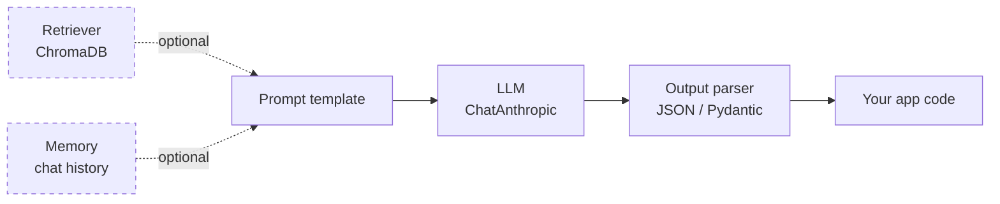

# 06 — LangChain and the Claude API

## Lectures covered
- LangChain Installation and Setup
- Calling LLM from LangChain
- Prompt Templates & Chains
- SQLite Database Integration
- Streamlit UI Development
- The Claude (Anthropic) Python SDK

---

## In one sentence
The **Anthropic SDK** is the minimal way to call Claude; **LangChain** is a Python library that wraps SDKs into reusable building blocks (prompts, chains, retrievers, agents) so you can compose Gen AI apps from parts.

## Real-world analogy
The Claude SDK is the engine — raw, fast, and you steer every cylinder yourself. LangChain is the chassis: standardised mounts for engines, gearboxes, wheels (LLMs, retrievers, tools). For a quick scooter you might skip the chassis. For a production vehicle, the chassis saves you re-inventing wiring every time.

## The intuition (plain English)
- For a single LLM call, the **plain SDK is fewer lines and easier to debug**. Start there.
- LangChain shines when you **stitch together** retrieval, prompts, parsing, memory, and tools — and when you want to swap providers without rewriting the app.
- LangChain has two halves: **LangChain Core** (prompts, models, chains, parsers via the `|` operator) and **LangGraph** (state machines for agents).
- You don't need every LangChain feature. Most production code uses ~5 building blocks.
- Claude is your default model in this bootcamp. LangChain has a first-class `ChatAnthropic` integration.

## Mini worked example — same task, two stacks

Task: take a topic, ask Claude for 3 bullet points, and parse them into a Python list.

### Plain Anthropic SDK

```python
import anthropic, json

client = anthropic.Anthropic()

resp = client.messages.create(
    model="claude-sonnet-4-6",
    max_tokens=512,
    system='Return ONLY a JSON list of strings, no prose.',
    messages=[{"role": "user", "content": "3 surprising facts about octopuses"}],
)
bullets = json.loads(resp.content[0].text)
print(bullets)
```

### LangChain

```python
from langchain_anthropic import ChatAnthropic
from langchain_core.prompts import ChatPromptTemplate
from langchain_core.output_parsers import JsonOutputParser

llm = ChatAnthropic(model="claude-sonnet-4-6", max_tokens=512)
prompt = ChatPromptTemplate.from_messages([
    ("system", "Return ONLY a JSON list of strings, no prose."),
    ("user",   "3 surprising facts about {topic}"),
])
chain = prompt | llm | JsonOutputParser()

bullets = chain.invoke({"topic": "octopuses"})
print(bullets)
```

The plain SDK has fewer moving parts. LangChain wins as soon as you add a second step (e.g. embed → retrieve → prompt → parse).

## At-a-glance



## Why this matters
- Almost every production Gen AI app you'll see uses one of these two stacks.
- LangChain's `|` (LCEL — LangChain Expression Language) is a clean, composable way to express the prompt → model → parser pipeline.
- Knowing both lets you pick the right tool: SDK for surgery, LangChain for assembly.
- Streamlit on top gives you a working web UI in 30 lines.

---

## Deep dive

### 1. Setup

```bash
# Anthropic SDK
pip install anthropic

# LangChain stack
pip install langchain-anthropic langchain-core langchain-community
pip install chromadb voyageai           # for RAG
pip install langgraph                   # for stateful agents
pip install streamlit                   # for the UI
```

```bash
export ANTHROPIC_API_KEY=sk-ant-...
export VOYAGE_API_KEY=...
```

### 2. The 5 LangChain building blocks you'll actually use

| Piece | What it does |
|---|---|
| `ChatAnthropic` | Model wrapper around the Claude API. |
| `ChatPromptTemplate` | Turn variables + role into a `messages` array. |
| `Runnable` chains via `|` | Compose `prompt | llm | parser` like Unix pipes. |
| Output parsers (`StrOutputParser`, `JsonOutputParser`, `PydanticOutputParser`) | Convert Claude's text to typed Python objects. |
| `RunnableLambda` / `RunnablePassthrough` | Inject custom Python steps into the chain. |

### 3. A real RAG chain in LangChain

```python
from langchain_anthropic import ChatAnthropic
from langchain_core.prompts import ChatPromptTemplate
from langchain_core.runnables import RunnablePassthrough
from langchain_core.output_parsers import StrOutputParser
from langchain_community.vectorstores import Chroma
from langchain_voyageai import VoyageAIEmbeddings

# 1. Vector store
embeddings = VoyageAIEmbeddings(model="voyage-3")
vectorstore = Chroma(collection_name="hr", embedding_function=embeddings, persist_directory="./chroma_db")
retriever = vectorstore.as_retriever(search_kwargs={"k": 4})

# 2. Prompt
prompt = ChatPromptTemplate.from_messages([
    ("system",
     "Answer using ONLY the context. Cite chunk indices like [1], [2]. "
     "If unknown, say you don't know."),
    ("user",
     "<context>\n{context}\n</context>\n\nQuestion: {question}"),
])

# 3. Model
llm = ChatAnthropic(model="claude-sonnet-4-6", max_tokens=512)

# 4. Chain
def format_docs(docs):
    return "\n\n".join(f"[{i+1}] {d.page_content}" for i, d in enumerate(docs))

rag_chain = (
    {"context": retriever | format_docs, "question": RunnablePassthrough()}
    | prompt
    | llm
    | StrOutputParser()
)

print(rag_chain.invoke("How much paid leave do I get?"))
```

That's a full RAG app in ~25 lines.

### 4. Tool use / agents with LangGraph

For agents you want **state** (the message history, scratchpad, retry counter). LangGraph gives you a typed state machine.

```python
from typing import Annotated, TypedDict
from langgraph.graph import StateGraph, END
from langgraph.graph.message import add_messages
from langchain_anthropic import ChatAnthropic
from langchain_core.tools import tool

@tool
def get_weather(city: str) -> str:
    """Get current weather for a city."""
    return f"54F, 78% rain in {city}"

llm = ChatAnthropic(model="claude-sonnet-4-6").bind_tools([get_weather])

class State(TypedDict):
    messages: Annotated[list, add_messages]

def call_model(state: State):
    return {"messages": [llm.invoke(state["messages"])]}

def should_continue(state: State):
    last = state["messages"][-1]
    return "tools" if last.tool_calls else END

from langgraph.prebuilt import ToolNode
graph = StateGraph(State)
graph.add_node("agent", call_model)
graph.add_node("tools", ToolNode([get_weather]))
graph.set_entry_point("agent")
graph.add_conditional_edges("agent", should_continue)
graph.add_edge("tools", "agent")

agent = graph.compile()
out = agent.invoke({"messages": [{"role": "user", "content": "Umbrella in Seattle?"}]})
print(out["messages"][-1].content)
```

This is the same loop from [04-agents-tool-use.md](./04-agents-tool-use.md), just expressed as a graph.

### 5. Talking to a SQL database

Any agent can query SQL via a tool. LangChain has a high-level helper:

```python
from langchain_community.utilities import SQLDatabase
from langchain_community.agent_toolkits.sql.base import create_sql_agent

db = SQLDatabase.from_uri("sqlite:///northwind.db")
agent = create_sql_agent(llm=ChatAnthropic(model="claude-sonnet-4-6"), db=db, verbose=True)

agent.invoke({"input": "Top 5 customers by total order value in 1997?"})
```

The agent reads the schema, writes a SQL query, runs it, and explains the result. For production, lock the DB user to read-only.

### 6. Streamlit UI in 30 lines

```python
# app.py
import streamlit as st
from langchain_anthropic import ChatAnthropic
from langchain_core.messages import HumanMessage, AIMessage

st.title("Claude Chat")

if "history" not in st.session_state:
    st.session_state.history = []

for m in st.session_state.history:
    with st.chat_message("user" if isinstance(m, HumanMessage) else "assistant"):
        st.markdown(m.content)

if user_input := st.chat_input("Ask anything..."):
    st.session_state.history.append(HumanMessage(content=user_input))
    with st.chat_message("user"):
        st.markdown(user_input)

    llm = ChatAnthropic(model="claude-sonnet-4-6", max_tokens=1024, streaming=True)

    with st.chat_message("assistant"):
        placeholder = st.empty()
        full = ""
        for chunk in llm.stream(st.session_state.history):
            full += chunk.content
            placeholder.markdown(full)
        st.session_state.history.append(AIMessage(content=full))
```

Run with `streamlit run app.py`.

### 7. Streaming, async, and batching

```python
# Streaming (lowers perceived latency)
with client.messages.stream(model="claude-sonnet-4-6", max_tokens=512,
                            messages=[...]) as stream:
    for text in stream.text_stream:
        print(text, end="", flush=True)

# Async — for handling many users concurrently
import asyncio
async_client = anthropic.AsyncAnthropic()
async def go():
    return await async_client.messages.create(...)
asyncio.run(go())

# Batch API — half-price, for offline jobs (Anthropic Message Batches)
batch = client.messages.batches.create(
    requests=[{"custom_id": f"r{i}", "params": {...}} for i in range(1000)]
)
```

### 8. SDK vs LangChain — when to pick which

| Situation | Pick |
|---|---|
| One-off script, single LLM call | **SDK** |
| Tight latency budget, no abstractions tax | **SDK** |
| Multi-step pipeline (RAG, parse, retry) | **LangChain** |
| Multi-provider (swap Claude / GPT / Gemini) | **LangChain** |
| Stateful agent with branching | **LangGraph** |
| Multi-agent role-based collaboration | **CrewAI** or LangGraph |
| Production app for AWS-only org | Bedrock SDK + AgentCore |

A common pattern: prototype on plain SDK → harden as a LangChain chain → wrap in LangGraph if it grows agentic.

### 9. Prompt caching, the right way

If you're sending Claude the same large system prompt every call (a long rulebook, a code style guide, a whole API reference), **cache it**:

```python
client.messages.create(
    model="claude-sonnet-4-6",
    max_tokens=1024,
    system=[{
        "type": "text",
        "text": LONG_RULEBOOK,                    # 30K tokens
        "cache_control": {"type": "ephemeral"},
    }],
    messages=[{"role": "user", "content": user_q}],
)
```

LangChain has equivalents on `ChatAnthropic`. With caching enabled, repeated calls cost roughly **10% of the cached portion** for input tokens. For chatbots this is the single biggest cost lever.

---

## Common pitfalls
- Pinning to an old LangChain version. The library moves fast — stick close to current docs.
- Importing from `langchain` instead of `langchain_anthropic` / `langchain_core`. The package layout split a while back.
- Hardcoding model names everywhere. Centralise them in a config.
- Re-creating the `ChatAnthropic` client inside a hot loop. Make one and reuse.
- Forgetting to set `max_tokens`. The default may be small; long responses get truncated.
- Catching only generic exceptions. Distinguish `RateLimitError`, `APIConnectionError`, `BadRequestError` for proper retry logic.
- Streaming UI with no error handling — partial responses on disconnect look broken.
- Putting secrets in source. Use `.env` and `python-dotenv` or a secrets manager.
- Building a giant LangChain DAG before having a working SDK call. Always crawl → walk → run.

---

## Glossary

| Term | Plain meaning |
|---|---|
| Anthropic SDK | The official `anthropic` Python package for calling Claude. |
| `Anthropic()` | The sync client class. |
| `AsyncAnthropic()` | The async client class. |
| `messages.create` | The main method to send a chat-style call. |
| `messages.stream` | Streaming variant — yields tokens as they arrive. |
| Batch API | Submit many requests asynchronously at half price. |
| `count_tokens` | Estimate token usage before calling. |
| Prompt caching | Anthropic feature to re-use a long prefix at ~10% cost. |
| LangChain | Python library for building Gen AI apps from composable parts. |
| LangChain Core | Base abstractions: Runnable, Prompt, Parser. |
| LCEL | LangChain Expression Language — `prompt | llm | parser` syntax. |
| Runnable | Anything you can `.invoke(input)` on; chains are runnables. |
| `ChatAnthropic` | LangChain wrapper around the Claude API. |
| `ChatPromptTemplate` | Reusable prompt with placeholders. |
| Output parser | Converts model text into typed objects (str, JSON, Pydantic). |
| Retriever | Object with `.get_relevant_documents(query)` — the RAG fetch step. |
| Vector store | Wrapper around a vector DB (Chroma, FAISS, Pinecone). |
| Tool / Function | A callable the LLM can request via tool use. |
| LangGraph | LangChain's state-machine library for agents. |
| State | Shared dict passed between graph nodes. |
| Node | A function in the LangGraph graph. |
| Edge | Transition between nodes (can be conditional). |
| ToolNode | Pre-built LangGraph node that runs tools. |
| CrewAI | Role-based multi-agent framework. |
| Streamlit | Python framework for instant web UIs. |
| Streaming | Returning tokens as they're generated. |
| Async | Concurrent execution using `asyncio`. |
| Memory | Mechanism to carry chat history or facts across calls. |

## Further reading
- Previous: [05-fine-tuning-llms.md](./05-fine-tuning-llms.md)
- Next: [07-evaluation-llm-apps.md](./07-evaluation-llm-apps.md)
- [03-rag-vector-databases.md](./03-rag-vector-databases.md) — the retrieval half
- [04-agents-tool-use.md](./04-agents-tool-use.md) — tool-use mechanics
- Anthropic — [Python SDK](https://github.com/anthropics/anthropic-sdk-python)
- Anthropic — [Messages API reference](https://docs.anthropic.com/en/api/messages)
- LangChain — [Conceptual guide](https://python.langchain.com/docs/concepts/)
- LangChain — [LCEL docs](https://python.langchain.com/docs/expression_language/)
- LangGraph — [Tutorials](https://langchain-ai.github.io/langgraph/)
- Streamlit — [Chat elements](https://docs.streamlit.io/develop/concepts/architecture/streamlit-chat)
