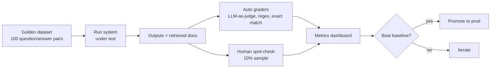

# 07 — Evaluating LLM Apps

## Lectures covered
- Agentic AI Evaluation
- Hallucinations, Security, Cost
- Faithfulness, relevance, factuality metrics
- Building golden datasets
- LLM-as-judge

---

## In one sentence
Evaluating an LLM app is the discipline of grading non-deterministic text outputs against a fixed test set so you can ship changes confidently — without it, every prompt tweak is a guess.

## Real-world analogy
Imagine running a restaurant where every dish comes out slightly different and the chef won't tell you what's in it. Without a tasting menu and consistent reviewers, you can't know if last week's "improvement" actually helped. An **eval set** is your tasting menu; **LLM-as-judge** or human review is your reviewer.

## The intuition (plain English)
- LLM outputs are **non-deterministic** — the same prompt can give different answers. Standard ML metrics (accuracy, F1) need careful adaptation.
- The minimum viable eval is a **golden set**: 30-200 hand-curated `(input, ideal output)` pairs you score every change against.
- For RAG, the two big questions are: *did we retrieve the right context?* and *did the model stick to it?* — that's **retrieval quality** and **faithfulness**.
- For agents, the big questions are: *did it pick the right tool?* and *did it eventually finish correctly?*
- You can grade automatically with **LLM-as-judge** (one model scores another) — fast, but you must validate it agrees with humans.

## Mini worked example — grading a RAG bot

Golden set entry (one of 100):

```json
{
  "question": "How many vacation days do new hires get in their first year?",
  "ideal_answer": "10 days, prorated by start date.",
  "ideal_sources": ["policy_v3#section-4.2"]
}
```

Run the bot, get its answer + cited sources. Score four things:

| Metric | How to compute |
|---|---|
| **Retrieval recall** | Did the retrieved chunks contain `policy_v3#section-4.2`? 1/0 |
| **Faithfulness** | Did the answer use ONLY info present in retrieved chunks? LLM-as-judge: 1/0 |
| **Answer correctness** | Does the answer match `ideal_answer`? LLM-as-judge similarity: 0-1 |
| **Citation accuracy** | Are the cited sources actually correct? 1/0 |

Average across 100 examples → 4 scalar scores. That's your dashboard. Every prompt or retrieval change must move at least one up without dragging others down.

## At-a-glance



## Why this matters
- "Vibe-checking" three examples in a notebook is how teams ship regressions.
- Without evals you can't know if a prompt change, model upgrade, or retriever swap helped or hurt.
- Hallucination detection requires structured measurement — not a hunch.
- Eval discipline separates demo-grade GenAI from production-grade GenAI.

---

## Deep dive

### 1. The evaluation hierarchy

```
Level 0: Manual vibe check     ← everyone starts here
Level 1: Static golden set     ← minimum bar for shipping
Level 2: LLM-as-judge          ← scales evaluation cheaply
Level 3: Online evals          ← grade live traffic
Level 4: Human-in-the-loop     ← ground truth for high-stakes
```

You climb the levels as the app matures. Don't skip levels — they reinforce each other.

### 2. Building a golden set

| Source | Pros | Cons |
|---|---|---|
| Hand-written by domain expert | High quality | Slow |
| Real user logs (anonymised) | Realistic distribution | Need labels |
| Synthetic from LLM | Fast, broad coverage | Risk of unrealistic phrasing |

A practical recipe:
1. Take 50 real questions from logs.
2. Have a human write the ideal answer (with citations if RAG).
3. Add 20 adversarial / edge-case questions: ambiguous, out-of-scope, malicious.
4. Add 30 LLM-generated paraphrases for diversity.
5. Lock the file. **Never train on it.** Treat it like a test set.

```jsonl
{"id": "q001", "input": "How many vacation days?", "ideal": "10 days...", "tags": ["leave", "policy"]}
{"id": "q002", "input": "Will the company pay my taxes?", "ideal": "Out of scope.", "tags": ["adversarial"]}
```

### 3. Metrics for plain LLM tasks

| Task | Metric |
|---|---|
| Classification | Accuracy, F1 |
| Extraction (NER, fields) | Field-level F1 |
| Summarisation | ROUGE / BERTScore + LLM-as-judge |
| Translation | BLEU / COMET |
| Free-form QA | Exact match, F1, LLM-as-judge |
| Code generation | Pass@k on unit tests |

### 4. Metrics for RAG

The famous **RAGAS** framework defines four core metrics:

| Metric | Question it answers |
|---|---|
| **Faithfulness** | Is every claim in the answer supported by retrieved context? |
| **Answer relevance** | Does the answer actually address the question? |
| **Context precision** | Of retrieved chunks, how many are actually relevant? |
| **Context recall** | Of the relevant chunks that exist, how many did we retrieve? |

```python
# pip install ragas datasets
from ragas import evaluate
from ragas.metrics import faithfulness, answer_relevancy, context_precision, context_recall
from datasets import Dataset

ds = Dataset.from_list([
    {
        "question": "How many vacation days?",
        "answer": "10 days prorated.",
        "contexts": ["Employees get 10 days, prorated by start date."],
        "ground_truth": "10 days, prorated.",
    },
    # ... 99 more
])

results = evaluate(ds, metrics=[faithfulness, answer_relevancy, context_precision, context_recall])
print(results)
```

### 5. Metrics for agents

| Metric | Description |
|---|---|
| **Task success rate** | Did the agent reach the correct end state? |
| **Tool selection accuracy** | Did it pick the right tool at each step? |
| **Plan length** | How many steps did it take? Lower is usually better. |
| **Cost per task** | $ and tokens consumed end-to-end. |
| **Latency p50/p95** | Time from request to completion. |
| **Error / fallback rate** | How often did it fail or escalate? |

For agents, you also need **trajectory traces** — every tool call, every intermediate thought — saved for offline replay.

### 6. LLM-as-judge

Use a stronger model (Claude Opus or similar) to grade the outputs of a weaker / production model.

```python
import anthropic
client = anthropic.Anthropic()

JUDGE_PROMPT = """You are an impartial judge. Score the candidate answer 1-5 against the reference.

Question: {question}
Reference answer: {reference}
Candidate answer: {candidate}

Output ONLY JSON: {{"score": int 1-5, "reason": "..."}}"""

def judge(question, reference, candidate):
    resp = client.messages.create(
        model="claude-sonnet-4-6",
        max_tokens=200,
        temperature=0,
        messages=[{"role": "user",
                   "content": JUDGE_PROMPT.format(
                       question=question, reference=reference, candidate=candidate)}],
    )
    import json
    return json.loads(resp.content[0].text)
```

Validate the judge by **measuring agreement with human ratings** on a sample of 30-50 examples. Aim for Cohen's kappa > 0.6. If the judge disagrees with humans systematically, calibrate the rubric.

### 7. Detecting hallucinations specifically

| Technique | How |
|---|---|
| **Self-consistency** | Sample 5 answers; if they disagree, flag uncertainty. |
| **Citation check** | Require the model to cite chunk IDs; verify each chunk truly contains the claim. |
| **Faithfulness LLM judge** | Ask: "is every claim supported by context? List unsupported claims." |
| **Uncertainty prompts** | Instruct the model to say "I don't know" if not in context. Measure abstention rate. |
| **Entailment models** | Use an NLI model to check `context entails answer`. |

### 8. Online evals — grading live traffic

Once shipped, sample ~1% of real user calls and grade them in the background:

```python
# Pseudocode for an online eval hook
def serve(user_q):
    answer = rag_chain.invoke(user_q)
    if random.random() < 0.01:
        background_queue.put({"q": user_q, "a": answer, "ts": now()})
    return answer

# Worker
def background_grade():
    while True:
        item = background_queue.get()
        score = judge(item["q"], reference=None, candidate=item["a"])  # reference-free judge
        emit_metric("live_quality", score["score"])
```

Watch the metric drift over time. A sudden drop is a regression alert.

### 9. Cost and latency are also evals

Quality is necessary but not sufficient. Always track:

| Metric | Why |
|---|---|
| Tokens / call (input, output) | Direct cost driver |
| $ / call | Trivially: tokens × price |
| p50 / p95 latency | UX killer above ~3s |
| Cache hit rate | Reveals caching effectiveness |
| Tool calls / task | Cost driver in agents |

A "better" model that doubles cost and latency for +2% accuracy may not be worth it. Evals make the tradeoff visible.

### 10. Tools to know

| Tool | Niche |
|---|---|
| **RAGAS** | RAG-specific metrics. |
| **DeepEval** | Pytest-style LLM testing. |
| **LangSmith** | LangChain's hosted tracing + eval platform. |
| **Promptfoo** | YAML-based prompt testing across providers. |
| **Inspect AI** | UK AISI's evaluation framework, agentic-friendly. |
| **Anthropic Evals** | Anthropic's open-source eval harness. |

---

## Common pitfalls
- Treating eval as one-time. It's a CI/CD artefact — run on every change.
- Tiny golden set (5 examples). Random noise drowns the signal; shoot for ≥30 per slice.
- Training on the eval set (data leakage). Lock it.
- Single metric. Quality is multi-dimensional. Track at least: correctness, faithfulness, latency, cost.
- LLM judge that disagrees with humans. Validate before trusting.
- No adversarial examples. Real users will jailbreak, contradict, ramble.
- Ignoring abstention. A model that says "I don't know" correctly is more valuable than one that confidently makes things up.
- Comparing systems with different prompts. Hold confounders fixed.
- Forgetting that LLMs change. Lock model snapshots and monitor drift after upgrades.
- No traces. When something goes wrong in an agent, you need every intermediate step.

---

## Glossary

| Term | Plain meaning |
|---|---|
| Eval / evaluation | Automated grading of LLM outputs. |
| Golden set | A fixed labelled test set used to grade every change. |
| Ground truth | The correct answer for a given input. |
| LLM-as-judge | Using an LLM to score another LLM's output. |
| Reference-based eval | Compare candidate vs known reference answer. |
| Reference-free eval | Score outputs without a known reference (faithfulness, relevance). |
| Faithfulness | Does the answer stick to the retrieved context? |
| Hallucination | A claim with no support in source material. |
| Answer relevance | Does the response address the question? |
| Context precision | Fraction of retrieved chunks that are relevant. |
| Context recall | Fraction of relevant chunks that were retrieved. |
| RAGAS | Library for RAG-specific metrics. |
| ROUGE | Word-overlap metric for summarisation. |
| BLEU | n-gram overlap metric for translation. |
| BERTScore | Embedding-based similarity metric. |
| Pass@k | Fraction of code outputs that pass tests, given k samples. |
| F1 | Harmonic mean of precision and recall. |
| Cohen's kappa | Inter-rater agreement adjusted for chance. |
| Trajectory | Full sequence of an agent's thoughts and actions. |
| Trace | Stored record of one full LLM/agent run. |
| Tracing | Logging every step of a chain or agent for debugging. |
| Online eval | Sampling live traffic for grading. |
| Drift | Quality changing over time (data, model, or prompt). |
| Adversarial example | An input crafted to break the system. |
| Abstention | The model declining to answer when uncertain. |
| Calibration | How well a model's confidence matches its accuracy. |
| LangSmith | LangChain's hosted tracing/eval platform. |
| DeepEval | Pytest-style LLM testing framework. |
| Promptfoo | YAML-driven prompt evaluation tool. |

## Further reading
- Previous: [06-langchain-claude-api.md](./06-langchain-claude-api.md)
- Next: [08-deployment-cost.md](./08-deployment-cost.md)
- [Module 6 — Model evaluation](../06-machine-learning/05-lifecycle-mlops/) — classical ML eval is still useful intuition
- [03-rag-vector-databases.md](./03-rag-vector-databases.md) — what you're evaluating in RAG
- [04-agents-tool-use.md](./04-agents-tool-use.md) — what you're evaluating in agents
- RAGAS — [Documentation](https://docs.ragas.io/)
- DeepEval — [GitHub](https://github.com/confident-ai/deepeval)
- LangSmith — [Docs](https://docs.smith.langchain.com/)
- Anthropic — [Evaluating prompts](https://docs.anthropic.com/en/docs/test-and-evaluate/develop-tests)
- Promptfoo — [Docs](https://www.promptfoo.dev/docs/intro/)
