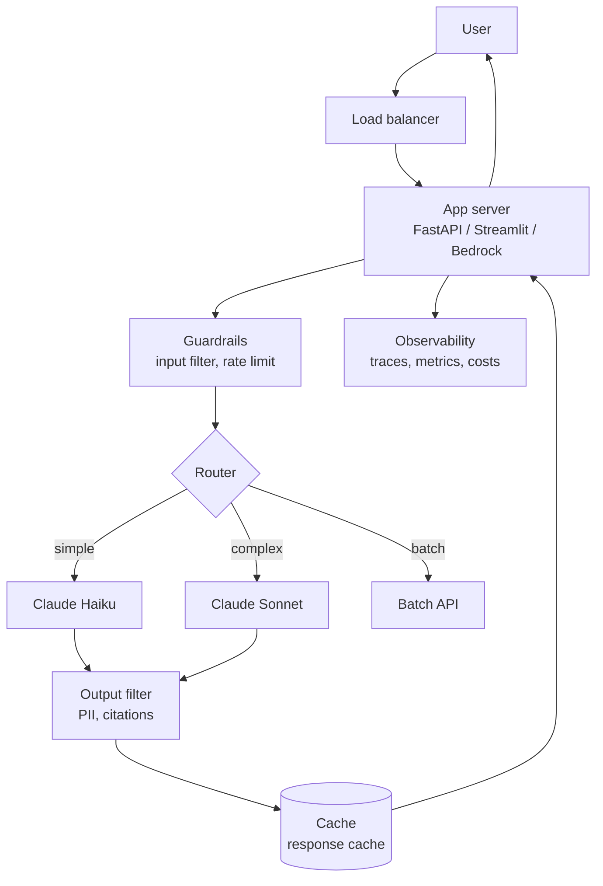
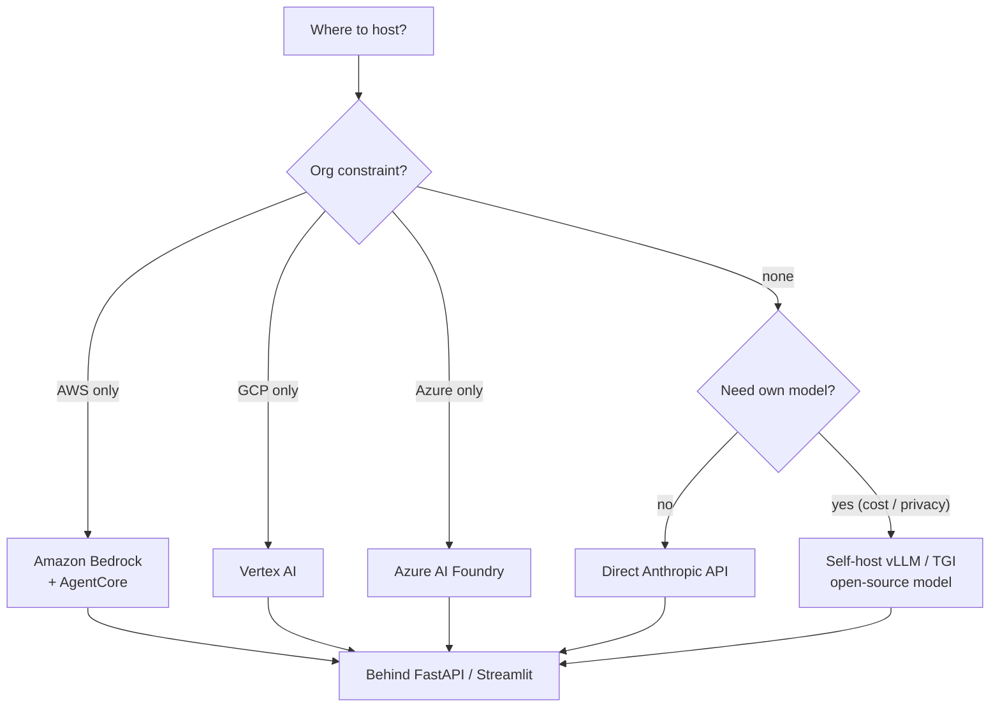

# 08 — Deployment, Latency, and Cost

## Lectures covered
- Gen AI Application Development Steps
- Hallucinations, Security, Cost
- Streamlit UI Development
- Amazon Bedrock AgentCore
- Production patterns: caching, rate limits, observability

---

## In one sentence
Deploying a Gen AI app means turning a notebook prototype into a live service that's fast enough, cheap enough, safe enough, and observable enough to leave running while you sleep.

## Real-world analogy
A demo is a recipe you cook once for a friend. A production deployment is opening a restaurant: ingredients sourced reliably (model providers), kitchen sized for peak (concurrency), prices that don't bankrupt you (cost controls), health inspectors happy (security), and a feedback book by the door (observability). Skipping any of these turns a great recipe into a closed business.

## The intuition (plain English)
- Every Gen AI deploy fights three trade-offs: **quality vs latency**, **quality vs cost**, **safety vs flexibility**.
- The biggest cost wins are: prompt caching, smaller models for easy traffic, batching offline workloads, and aggressive token discipline.
- The biggest latency wins are: streaming, parallel tool calls, smaller models, and less context.
- The biggest reliability wins are: timeouts, retries with backoff, fallback models, and circuit breakers around tool calls.
- The biggest safety wins are: input/output filters, prompt-injection guards, secret scanning, and per-user rate limits.

## Mini worked example — back-of-envelope unit economics

A customer-support chatbot with:
- 50,000 conversations/day
- Average 4 turns each
- ~1,000 input tokens, 200 output tokens per turn (Claude Sonnet pricing illustrative: $3/$15 per million)

```
Calls per day:        50,000 * 4 = 200,000
Input tokens/day :    200,000 * 1,000 = 200M
Output tokens/day:    200,000 * 200   = 40M

Daily cost (no caching):
  Input  : 200 * $3  = $600
  Output : 40  * $15 = $600
  Total  : $1,200/day = ~$36k/month

With prompt caching on the 800-token system prompt (cache hit on 90% of calls):
  Cached portion: 800 * 0.9 * 200,000 = 144M tokens at ~10% price
  Saving:         ~$300/day → ~$9k/month saved
```

That's why prompt caching is the first lever you pull, not the last.

## At-a-glance



## Why this matters
- Most Gen AI projects die not in modelling, but in production: cost overruns, latency complaints, security incidents.
- A 2× cost reduction is often a prompt-cache config + model-tier router away.
- LLM downtime is a real failure mode — design for it.
- Compliance, PII, and prompt injection are now table stakes for any internal tool.

---

## Deep dive

### 1. The deploy decision tree



### 2. Latency budget

A user expects a chat response to **start** in under 1 second.

| Source | Typical contribution |
|---|---|
| Network round-trip | 50-300 ms |
| LLM time-to-first-token (TTFT) | 300-1500 ms |
| Tool calls (RAG, search, etc.) | 100-1000 ms each |
| Output generation | depends on length |
| Your app code | should be < 50 ms |

Levers to reduce latency:
- **Stream** the response — TTFT becomes the user-felt latency.
- Use a **smaller model** (Claude Haiku, Llama-8B) for routine traffic; route complex queries to Sonnet/Opus.
- **Parallelise** independent tool calls (`asyncio.gather`).
- **Cache** retrievals and embeddings — recomputing every request is wasteful.
- **Trim context**: shorter system prompts, fewer retrieved chunks, summarised history.

### 3. Cost levers, ranked by impact

| Lever | Typical savings | Effort |
|---|---|---|
| Prompt caching (Anthropic) | 50-90% on repeated prefixes | Low |
| Model routing (Haiku for easy, Sonnet for hard) | 30-70% | Medium |
| Reducing output `max_tokens` | 10-30% | Trivial |
| Reducing retrieved chunks (k=10 → k=4) | 20-40% | Low |
| Batch API for offline jobs | 50% | Low |
| Self-hosting an open model | situational | High |
| Fine-tuning a small model | up to 90% | High |

```python
# Routing example
def pick_model(user_msg):
    if len(user_msg) < 100 and not needs_reasoning(user_msg):
        return "claude-haiku-4-5"
    return "claude-sonnet-4-6"
```

### 4. Reliability patterns

```python
import anthropic, time, random

client = anthropic.Anthropic()

def call_with_retry(messages, max_retries=4):
    for attempt in range(max_retries):
        try:
            return client.messages.create(
                model="claude-sonnet-4-6",
                max_tokens=1024,
                messages=messages,
                timeout=30.0,
            )
        except (anthropic.RateLimitError, anthropic.APIConnectionError):
            wait = 2 ** attempt + random.random()        # exponential backoff
            time.sleep(wait)
        except anthropic.BadRequestError:
            raise                                         # don't retry bad input
    raise RuntimeError("Exceeded retries")
```

Beyond retries:
- **Fallback model**: if Sonnet is down, drop to Haiku or another provider.
- **Circuit breaker**: stop hammering a failing dependency for N seconds.
- **Idempotency keys** for write tools so retries don't duplicate side effects.
- **Health checks** that periodically issue a known prompt and assert a known answer.

### 5. Security checklist

| Risk | Mitigation |
|---|---|
| **Prompt injection** | Treat every retrieved doc / tool output as untrusted. Don't blindly execute instructions found in them. |
| **PII leakage** | Scan inputs and outputs. Redact before logging. |
| **Secret exfiltration** | Never put API keys in prompts. Don't echo env vars. |
| **Unsafe content** | Use moderation filters (provider-built or open-source). |
| **Jailbreaks** | Strong system prompt + post-filter. Track refusal rate. |
| **Tool abuse** | Allowlist tools per role, confirm destructive actions. |
| **Cost DoS** | Rate-limit per user, cap output tokens, alert on anomalies. |
| **Data residency** | Pick regional endpoints (Bedrock regions, Vertex region locks). |
| **Auditability** | Persist every prompt, response, tool call with timestamps. |

A minimal moderation pre/post filter:

```python
def is_safe(text: str) -> bool:
    bad = ["api_key", "social security number", "<script>"]
    return not any(token in text.lower() for token in bad)

def serve(user_input):
    if not is_safe(user_input):
        return "Sorry, I can't help with that."
    answer = run_chain(user_input)
    if not is_safe(answer):
        return "Sorry, the response was filtered."
    return answer
```

For real apps use Anthropic's safety model, AWS Bedrock Guardrails, or Llama Guard.

### 6. Observability

Every request should produce a record:

```json
{
  "request_id": "req_abc123",
  "user_id_hashed": "u_8881",
  "ts": "2025-05-10T14:32:00Z",
  "model": "claude-sonnet-4-6",
  "input_tokens": 842,
  "output_tokens": 213,
  "cached_input_tokens": 700,
  "tool_calls": [{"name": "vector_search", "ms": 120}],
  "latency_ms": 1420,
  "cost_usd": 0.0034,
  "feedback": null,
  "trace": "..."
}
```

Dashboards you actually need:
- p50 / p95 / p99 latency
- $ / day, $ / user, $ / call
- Error rate by error type
- Tool-call success rate
- Eval score on sampled traffic (see [07-evaluation-llm-apps.md](./07-evaluation-llm-apps.md))
- Refusal rate (proxy for over-safety)

Tools: LangSmith, OpenTelemetry, Datadog, Honeycomb, Helicone, Phoenix.

### 7. Deploying with FastAPI

```python
# server.py
from fastapi import FastAPI
from pydantic import BaseModel
import anthropic

app = FastAPI()
client = anthropic.Anthropic()

class ChatIn(BaseModel):
    message: str

@app.post("/chat")
async def chat(body: ChatIn):
    resp = await anthropic.AsyncAnthropic().messages.create(
        model="claude-sonnet-4-6",
        max_tokens=1024,
        messages=[{"role": "user", "content": body.message}],
    )
    return {"reply": resp.content[0].text,
            "usage": {"in": resp.usage.input_tokens, "out": resp.usage.output_tokens}}
```

```bash
uvicorn server:app --host 0.0.0.0 --port 8000 --workers 4
```

Cross-link: see [FastAPI deployment](../07-deep-learning/05-deployment/02-fastapi.md) for the wider FastAPI patterns.

### 8. Streamlit for internal tools

Streamlit is the fastest way to give non-engineers a UI on top of your chain. See the chat example in [06-langchain-claude-api.md](./06-langchain-claude-api.md). Cross-link: [Streamlit basics](../07-deep-learning/05-deployment/01-streamlit.md).

For external/customer-facing apps, prefer a real frontend (Next.js + the SDK on the server) so you control auth, theming, and rate limiting.

### 9. Amazon Bedrock AgentCore

Bedrock is AWS's managed runtime for foundation models; **AgentCore** is its agent runtime layer.

- Hosts Claude, Llama, Mistral and more under one API.
- Adds **Guardrails** (content filtering, PII, denied topics).
- **AgentCore** provides memory, identity, observability, and a sandboxed code interpreter for agents.
- Useful when the org is AWS-only or needs IAM-based access control.

Sketch:

```python
import boto3
client = boto3.client("bedrock-runtime")

resp = client.converse(
    modelId="anthropic.claude-sonnet-4-6:0",
    messages=[{"role": "user", "content": [{"text": "Hello"}]}],
    inferenceConfig={"maxTokens": 512},
    guardrailConfig={"guardrailIdentifier": "gd-abc", "guardrailVersion": "1"},
)
print(resp["output"]["message"]["content"][0]["text"])
```

### 10. The pre-launch checklist

- [ ] Eval set scores meet a fixed bar (defined in [07-evaluation-llm-apps.md](./07-evaluation-llm-apps.md))
- [ ] p95 latency under target
- [ ] Cost per user / per day forecast within budget
- [ ] Prompt caching enabled where applicable
- [ ] Retries + timeouts on every external call
- [ ] Secrets in a vault, not source
- [ ] PII redaction on logs
- [ ] Rate limits per user / API key
- [ ] Guardrails (input + output filters)
- [ ] Tool allowlist per role
- [ ] Observability dashboards live
- [ ] Rollback plan: previous prompt + previous model snapshot
- [ ] Runbook for "the model is hallucinating" / "outage" / "cost spike"
- [ ] On-call rotation

Skip any of these and you'll meet them later, in production, at 2 AM.

---

## Common pitfalls
- Building a beautiful demo on Sonnet, then sending all traffic through it without a router.
- No prompt caching despite a giant static system prompt.
- Calling the LLM synchronously from a request handler with no timeout — one slow call blocks a worker forever.
- Logging full prompts including PII into plaintext logs.
- Hardcoding model IDs all over the codebase. Centralise.
- Treating retrieved web content as trusted input.
- No cost dashboard. The $50k surprise bill is real.
- Deploying without an eval gate. The next prompt change quietly regresses.
- Letting agents loop without a step cap or timeout.
- Single-region deploy when users are global. Latency tanks.
- Not testing the rollback path until you actually need it.

---

## Glossary

| Term | Plain meaning |
|---|---|
| Latency | Time from request to first token / full response. |
| TTFT | Time-to-first-token — when streaming, the user-felt wait. |
| Throughput | Concurrent requests a deployment can serve. |
| QPS | Queries per second. |
| Streaming | Returning tokens as they're generated. |
| Async | Concurrent execution using `asyncio`. |
| Batching | Combining many requests for efficiency or discount. |
| Batch API | Anthropic / OpenAI offline mode at half price. |
| Prompt caching | Anthropic feature reducing repeated-prefix cost ~10×. |
| Routing | Picking the right (cheap/expensive) model per request. |
| Fallback | Secondary path when primary fails. |
| Circuit breaker | Stops calling a failing dependency for a while. |
| Exponential backoff | Wait 1s, 2s, 4s, 8s between retries. |
| Idempotency | Same call twice produces same effect once. |
| Rate limit | Cap on requests per user / key / time window. |
| Guardrails | Pre/post filters protecting against unsafe content. |
| PII | Personally Identifiable Information. |
| Prompt injection | Hostile content that hijacks the model. |
| Jailbreak | User attempt to bypass safety rules. |
| Observability | The ability to ask "what happened?" after the fact. |
| Trace | Recorded sequence of one full request's steps. |
| Span | A single timed operation inside a trace. |
| OpenTelemetry | Vendor-neutral observability standard. |
| Bedrock | AWS managed foundation-model service. |
| AgentCore | AWS managed agent runtime. |
| Vertex AI | GCP managed model service. |
| Azure AI Foundry | Microsoft's managed AI platform. |
| FastAPI | Python web framework popular for ML serving. |
| Streamlit | Python framework for instant data UIs. |
| vLLM / TGI | Open-source LLM inference servers. |
| LangSmith | LangChain's hosted tracing/eval service. |
| Helicone / Phoenix | LLM-specific observability tools. |

## Further reading
- Previous: [07-evaluation-llm-apps.md](./07-evaluation-llm-apps.md)
- [Streamlit basics](../07-deep-learning/05-deployment/01-streamlit.md)
- [FastAPI deployment](../07-deep-learning/05-deployment/02-fastapi.md)
- [Module 6 — ML lifecycle / MLOps](../06-machine-learning/05-lifecycle-mlops/)
- Anthropic — [Prompt caching](https://docs.anthropic.com/en/docs/build-with-claude/prompt-caching)
- Anthropic — [Message Batches API](https://docs.anthropic.com/en/docs/build-with-claude/batch-processing)
- AWS — [Bedrock AgentCore](https://aws.amazon.com/bedrock/agentcore/)
- AWS — [Bedrock Guardrails](https://aws.amazon.com/bedrock/guardrails/)
- OWASP — [Top 10 for LLM Applications](https://owasp.org/www-project-top-10-for-large-language-model-applications/)
- Google — [Site Reliability Engineering book](https://sre.google/books/) (general SRE patterns)
