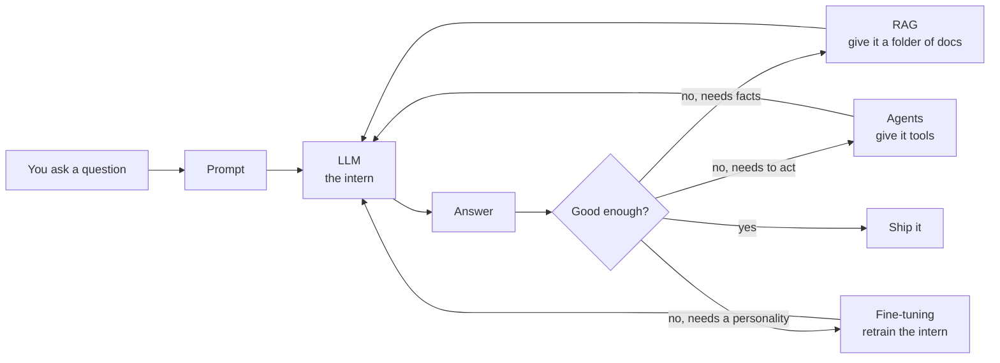

# Module 9 — Gen AI & Agentic AI

> **Status**: 🔒 Locked
> **Tools**: LangChain · LangGraph · Amazon Bedrock AgentCore · Claude MCP SDK · CrewAI · ChromaDB · Streamlit
> **Projects**: Real Estate Assistant (RAG) · E-Commerce Chatbot · Agentic AI HR Onboarding · Customer Care Agent (AgentCore)

---

## Onramp — read this first

If "Gen AI" still feels like a buzzword, start here. The next ten minutes give you a working mental model of the whole module before any tool name shows up.

### What is Gen AI in one sentence
A **Gen AI** model is a neural network that takes some text (or image/audio) in and produces new text (or image/audio) out — instead of just classifying or scoring it like older models did.

### The single mental model
Picture a very fast, very well-read intern. You hand them a note (the **prompt**), they hand you a draft back (the **completion**). Everything in this module is about making that intern more useful:



Read that arrow flow once more. Every chapter in this module clips into one of those four boxes: **prompt**, **RAG**, **agents**, **fine-tuning**.

### The four big questions this module answers

| Question | Where it lives |
|---|---|
| How do I talk to an LLM well? | [01-foundations/](./01-foundations/) — LLM fundamentals, context & temperature, prompt engineering |
| How do I make it answer from MY documents? | [02-rag/](./02-rag/) — vector databases, RAG pipeline, ChromaDB, fine-tuning vs RAG |
| How do I let it take actions (call APIs, read files)? | [04-agents/](./04-agents/) — agent fundamentals, multi-agent systems, evaluation |
| How do I tweak the model itself? | [02-rag/04-fine-tuning.md](./02-rag/04-fine-tuning.md) — LoRA / QLoRA / SFT |
| How do I build, test, and ship the app? | [03-orchestration/](./03-orchestration/) — LangChain, LangGraph, CrewAI, MCP, Bedrock AgentCore |
| Where do I see it all wired together? | [05-projects/](./05-projects/) — 4 portfolio projects |
| Where are the lecture zip resources? | [resources/](./resources/) |

### A real example to ground your intuition

You want a chatbot that answers questions about your company's HR policies.

1. **Plain LLM**: ask Claude — it doesn't know your policy docs, so it hallucinates.
2. **+ Prompting**: paste the relevant policy into the prompt — works for one doc, breaks for 500.
3. **+ RAG**: store all 500 docs as numeric vectors, look up the 3 most relevant per question, paste those into the prompt.
4. **+ Agents**: let the bot also book a meeting with HR if the user asks for one — that needs **tool use**.
5. **+ Evaluation**: build a test set of 50 real HR questions and check daily that the bot still gets ≥90% right.
6. **+ Deployment**: put it behind Streamlit, log every call, cap costs.

That's the entire module on one page. Each leaf file zooms into one step.

### Vocabulary cheat sheet (so the next pages don't lose you)

| Term | What you'll think of |
|---|---|
| **LLM** | The big text-in/text-out model (Claude, GPT, Gemini, Llama). |
| **Token** | A chunk of text (~3-4 characters of English). LLMs see and bill in tokens. |
| **Prompt** | The full text you send the model — instructions plus the user's question. |
| **Context window** | Max tokens the LLM can see at once (Claude: ~200K, sometimes 1M). |
| **Embedding** | A list of numbers representing a piece of text — semantically close texts get close numbers. |
| **Vector database** | A database optimised for "find me the closest embeddings". |
| **RAG** | Retrieval-Augmented Generation — fetch relevant docs, stuff them into the prompt. |
| **Agent** | An LLM in a loop that can decide to call tools (search, code, APIs). |
| **Tool** | A function the agent can invoke (e.g. `get_weather(city)`). |
| **Fine-tuning** | Continuing to train the LLM on your own examples. |
| **Hallucination** | Confidently wrong output. Your #1 enemy in production. |

### Pre-requisites

You'll move faster if you've already worked through:
- [Module 7 — Deep Learning](../07-deep-learning/README.md), especially [transformer architecture](../07-deep-learning/04-sequence/03-transformer-architecture.md) and [attention](../07-deep-learning/04-sequence/04-attention.md). LLMs **are** transformers.
- [Module 8 — NLP](../08-nlp/README.md), especially [word embeddings](../08-nlp/05-word-embeddings.md) and [BERT fine-tuning](../08-nlp/07-bert-finetuning-huggingface.md). Embeddings underpin RAG.
- Comfort calling a Python API and parsing JSON.

### Suggested reading order

Work through the numbered folders in order. Each folder's `README.md` lists its files and recommends an internal order.

1. **[01-foundations/](./01-foundations/)** — what LLMs are, the levers (context, temperature), prompt engineering, hallucinations/security/cost
2. **[03-orchestration/01-langchain.md](./03-orchestration/01-langchain.md)** — make your first real LLM call from Python
3. **[02-rag/](./02-rag/)** — vector DBs → the RAG pattern → ChromaDB → when to fine-tune instead
4. **[04-agents/](./04-agents/)** — tool-use, multi-agent patterns, agentic evaluation
5. **[03-orchestration/](./03-orchestration/)** (remaining files) — LangGraph, CrewAI, MCP, Amazon Bedrock AgentCore
6. **[05-projects/](./05-projects/)** — build all four portfolio projects, in order

Bundled lecture handouts and starter zips live in **[resources/](./resources/)**.

---

## Why this module exists

The 2025 data role is increasingly an **AI-engineering** role: building applications that wrap LLMs with retrieval, tools, memory, and orchestration. This is where Codebasics' bootcamp deviates from older curricula — they cover the **modern AI stack** end-to-end with 4 production-style projects.

## Curriculum (verbatim from brochure)

- Introduction to Gen AI & Agentic AI
- Application of Gen AI & Agentic AI
- Large Language Models
- AI Agent with Custom tools
- Context Window · Temperature
- Model Context Protocol (MCP)
- Agentic AI Evaluation
- Gen AI Application Development Steps
- Hallucinations, Security, Cost
- Vector Database
- RAG (Retrieval Augmented Generation)
- Streamlit UI Development
- Multi Agent Systems
- Zero-Shot, One-Shot, Few-Shot Prompting
- LangChain Installation and Setup
- Calling LLM from LangChain
- Prompt Templates & Chains
- Chromadb · Metadata Filtering
- Fine Tuning an LLM
- SQLite Database Integration
- LangGraph Crash course
- CrewAI crash course
- Amazon Bedrock AgentCore

## Folder layout

```
09-gen-ai-agentic-ai/
├── README.md
├── 01-foundations/
│   ├── README.md
│   ├── 01-intro-applications.md
│   ├── 02-llm-fundamentals.md
│   ├── 03-context-temperature.md
│   ├── 04-prompt-engineering.md
│   └── 05-hallucinations-security-cost.md
├── 02-rag/
│   ├── README.md
│   ├── 01-vector-databases.md
│   ├── 02-rag-fundamentals.md
│   ├── 03-chromadb-metadata.md
│   └── 04-fine-tuning.md
├── 03-orchestration/
│   ├── README.md
│   ├── 01-langchain.md
│   ├── 02-langgraph.md
│   ├── 03-crewai.md
│   ├── 04-mcp.md
│   └── 05-amazon-bedrock-agentcore.md
├── 04-agents/
│   ├── README.md
│   ├── 01-agent-fundamentals.md
│   ├── 02-multi-agent-systems.md
│   └── 03-agentic-evaluation.md
├── 05-projects/
│   ├── README.md
│   ├── 01-real-estate-rag.md
│   ├── 02-ecommerce-chatbot.md
│   ├── 03-agentic-onboarding-mcp.md
│   └── 04-customer-care-agentcore.md
└── resources/                          ← bundled lecture zips & starter files
    ├── GenAI_Finance_App_Resources.zip
    ├── GenAI_Project1_resources.zip
    └── GenAI_Project2_resources.zip
```

## Module-level goal

After this module:
- Build production-quality RAG systems
- Wire up agents with custom tools, plans, and memory
- Use LangChain / LangGraph / CrewAI fluently
- Understand MCP and how it standardizes tool integration
- Deploy on Amazon Bedrock AgentCore with proper observability
- Have 4 portfolio Gen-AI projects across real estate, e-commerce, HR, and customer care

## Module self-check

- [ ] When fine-tune vs prompt vs RAG?
- [ ] Walk through a RAG query end-to-end.
- [ ] What's the difference between ReAct and Plan-and-Execute?
- [ ] What's prompt injection and how mitigate it?
- [ ] What's MCP and what problem does it solve?
- [ ] Pick a vector DB for a small startup vs an enterprise.
- [ ] How do you evaluate a RAG system without humans in the loop?
- [ ] Why is LangGraph preferred over plain LangChain for complex agents?

---

## Module-wide glossary

| Term | Plain meaning |
|---|---|
| **Gen AI** | Generative AI — models that produce new content (text, image, audio, code), not just classify it. |
| **LLM** | Large Language Model — a transformer with billions of parameters trained on text. Claude, GPT, Gemini, Llama. |
| **Foundation model** | A big pre-trained model meant to be adapted to many tasks (LLMs are the text flavour). |
| **Token** | A subword unit. ~3-4 English characters per token on average. You're billed per token. |
| **Tokenizer** | The piece of code that splits text into tokens (e.g. BPE, SentencePiece, tiktoken). |
| **Context window** | Max tokens the model can attend to in one call (Claude Sonnet: 200K, Claude with 1M context: 1M). |
| **Prompt** | The text you send the model — usually a system message + user message. |
| **Completion / response** | The text the model returns. |
| **System prompt** | High-priority instructions that set the assistant's role and rules. |
| **User message** | The end-user's actual input. |
| **Few-shot** | Showing the model 2-5 example input/output pairs in the prompt. |
| **Zero-shot** | No examples in the prompt — just the task description. |
| **Chain-of-thought (CoT)** | Asking the model to "think step by step" before answering — boosts reasoning. |
| **Temperature** | Sampling randomness. 0 = deterministic, 1+ = creative. |
| **Top-p / nucleus sampling** | Only consider tokens whose probabilities sum to p. Controls diversity. |
| **Hallucination** | A confident but factually wrong output. The biggest production risk. |
| **Embedding** | A vector (e.g. 1024 floats) representing a piece of text. Similar texts → similar vectors. |
| **Vector database** | DB optimised for nearest-neighbour search over embeddings (Chroma, Pinecone, Weaviate, pgvector). |
| **Cosine similarity** | A score in [-1, 1] measuring how aligned two vectors are. The standard "are these similar?" metric. |
| **RAG** | Retrieval-Augmented Generation — fetch relevant docs, stuff them in the prompt, then ask the LLM. |
| **Chunking** | Splitting long documents into smaller passages before embedding. |
| **Reranker** | A second-stage model that re-orders retrieved chunks for relevance. |
| **Agent** | An LLM in a loop that can call tools and decide what to do next. |
| **Tool / function calling** | The model emits a JSON request like `{"tool":"search","args":{"q":"..."}}` and your code runs it. |
| **ReAct** | Reason + Act — the agent alternates between thinking and using tools. |
| **MCP** | Model Context Protocol — Anthropic's open standard for letting LLMs talk to tools and data sources. |
| **Multi-agent** | Several specialised agents collaborating (CrewAI, LangGraph nodes). |
| **LangChain** | Python library that glues LLMs, prompts, retrievers, and tools together. |
| **LangGraph** | LangChain's stateful graph framework for complex agent flows. |
| **CrewAI** | Library focused on role-based multi-agent orchestration. |
| **Streamlit** | Python framework for quickly building web UIs for LLM apps. |
| **Fine-tuning** | Continuing to train a base model on your own data. |
| **LoRA / QLoRA** | Cheap fine-tuning methods that train tiny adapters instead of all weights. |
| **Instruction tuning** | Fine-tuning so the model follows instructions rather than just predicting next text. |
| **RLHF** | Reinforcement Learning from Human Feedback — how raw LLMs become helpful assistants. |
| **Prompt injection** | An attacker hides instructions inside content the LLM will read, hijacking it. |
| **Guardrails** | Pre/post-processing checks that block bad inputs or outputs. |
| **Prompt caching** | Re-using the same long prefix across calls so you only pay for it once. Anthropic supports this natively. |
| **Latency** | Time from request to response. LLM users feel anything over ~2s. |
| **Throughput** | Requests per second a deployment can handle. |
| **Faithfulness** | Does the answer stick to the retrieved sources? Key RAG metric. |
| **Golden set** | A fixed labelled test set you score every model version against. |
| **Eval** | Short for "evaluation" — automated grading of LLM outputs. |
| **Bedrock AgentCore** | AWS-managed runtime for hosting agents with memory, tools, and observability. |

---

## Further reading

### Inside the bootcamp
- [Module 7 — Deep Learning](../07-deep-learning/README.md)
  - [Transformer architecture](../07-deep-learning/04-sequence/03-transformer-architecture.md)
  - [Attention](../07-deep-learning/04-sequence/04-attention.md)
  - [BERT with HuggingFace](../07-deep-learning/04-sequence/05-bert-huggingface.md)
- [Module 8 — NLP](../08-nlp/README.md)
  - [Word embeddings](../08-nlp/05-word-embeddings.md)
  - [BERT fine-tuning](../08-nlp/07-bert-finetuning-huggingface.md)
- [Module 6 — Machine Learning](../06-machine-learning/README.md) — classical ML intuition (still useful for evals, retrieval baselines, classification on top of LLMs)
- [BEGINNER-STYLE-GUIDE.md](../../BEGINNER-STYLE-GUIDE.md)

### External (free, high-signal)
- Anthropic — [Building effective agents](https://www.anthropic.com/research/building-effective-agents)
- Anthropic — [Prompt engineering overview](https://docs.anthropic.com/en/docs/build-with-claude/prompt-engineering/overview)
- Anthropic — [Tool use with Claude](https://docs.anthropic.com/en/docs/build-with-claude/tool-use)
- Anthropic — [Model Context Protocol (MCP)](https://modelcontextprotocol.io/)
- LangChain — [Conceptual guide](https://python.langchain.com/docs/concepts/)
- LangGraph — [Tutorials](https://langchain-ai.github.io/langgraph/)
- Pinecone — [Vector database explained](https://www.pinecone.io/learn/vector-database/)
- "The Illustrated Transformer" by Jay Alammar
- "What is ChatGPT doing… and why does it work?" by Stephen Wolfram
